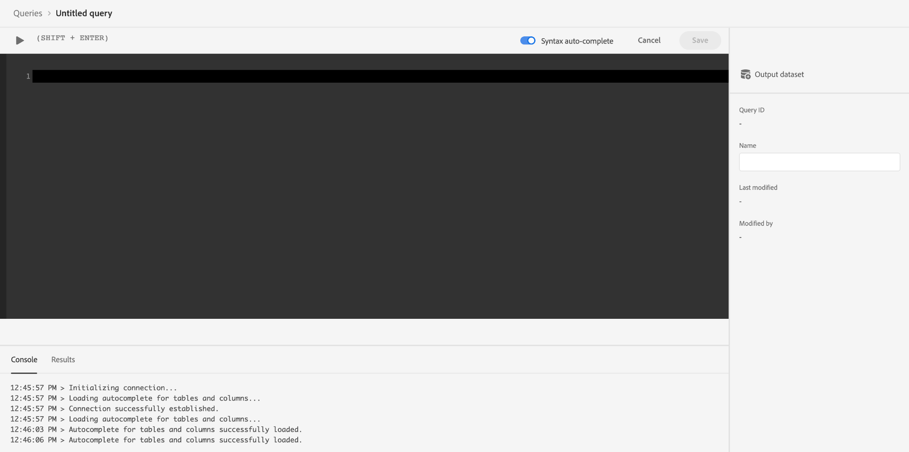

# 将Commerce数据连接到Adobe Experience Platform

当您安装 [!DNL Data Connection] 扩展，中会显示两个新的配置页面 **系统** 下的菜单 **服务** 在Commerce中 _管理员_.

- Commerce服务连接器
- [!DNL Data Connection]

要将Adobe Commerce实例连接到Adobe Experience Platform，必须配置这两个连接器，从Commerce服务连接器开始，然后使用 [!DNL Data Connection] 扩展。

## 配置Commerce服务连接器

如果以前安装过Adobe Commerce服务，则您可能已配置Commerce服务连接器。 如果没有，则必须在 [Commerce服务连接器](../landing/saas.md) 页面：

1. 登录到您的Commerce帐户以 [检索您的生产和沙盒API密钥](../landing/saas.md#credentials).
1. 选择 [SaaS数据空间](../landing/saas.md#saas-configuration).
1. 登录到您的Adobe帐户以 [检索您的组织ID](../landing/saas.md#ims-organization-optional).

配置Commerce服务连接器后，配置 [!DNL Data Connection] 扩展。

## 配置 [!DNL Data Connection] 扩展

在本节中，您将了解如何配置 [!DNL Data Connection] 扩展。

### 添加服务帐户和凭据详细信息

如果您计划收集并发送 [历史订单数据](#send-historical-order-data) 或 [客户个人资料数据](#send-customer-profile-data)，您必须添加服务帐户和凭据详细信息。 此外，如果您要配置 [Audience Activation](https://experienceleague.adobe.com/docs/commerce-admin/customers/audience-activation.html) 扩展上，您必须完成这些步骤。

如果您只收集和发送店面或后台数据，则可以跳至 [常规](#general) 部分。

#### 步骤1：在Adobe Developer控制台中创建项目

在Adobe Developer控制台中创建一个验证Commerce的项目，以便它能进行Experience PlatformAPI调用。

要创建项目，请按照 [验证和访问Experience PlatformAPI](https://experienceleague.adobe.com/docs/experience-platform/landing/platform-apis/api-authentication.html) 教程。

在学习本教程时，请确保您的项目具备以下条件：

- 访问以下内容 [产品配置文件](https://experienceleague.adobe.com/docs/experience-platform/landing/platform-apis/api-authentication.html#select-product-profiles)： **默认的生产所有访问权限** 和 **AEP默认所有访问**.
- 正确的 [角色和权限已配置](https://experienceleague.adobe.com/docs/experience-platform/landing/platform-apis/api-authentication.html#assign-api-to-a-role).
- 如果您决定使用JSON Web令牌(JWT)作为服务器到服务器的身份验证方法，则还必须上传私钥。

此步骤的结果将创建一个配置文件，供您在下一步中使用。

#### 步骤2：下载配置文件

下载 [工作区配置文件](https://developer.adobe.com/commerce/extensibility/events/project-setup/#download-the-workspace-configuration-file). 将此文件的内容复制并粘贴到 **服务帐户/凭据详细信息** 商务管理员页面。

1. 在Commerce管理员中，导航到 **商店** >设置> **配置** > **服务** > **[!DNL Data Connection]**.

1. 选择从实施的服务器到服务器授权方法 **Adobe Developer授权类型** 菜单。 Adobe建议使用OAuth。 已弃用JWT。 [了解详情](https://developer.adobe.com/developer-console/docs/guides/authentication/ServerToServerAuthentication/migration/).

1. （仅限JWT）复制并粘贴的内容 `private.key` 文件到 **客户端密码** 字段。 使用以下命令复制内容。

   ```bash
   cat config/private.key | pbcopy
   ```

   请参阅 [服务帐户(JWT)身份验证](https://developer.adobe.com/developer-console/docs/guides/authentication/JWT/) 欲知关于 `private.key` 文件。

1. 复制 `<workspace-name>.json` 文件到 **服务帐户/凭据详细信息** 字段。

   ![[!DNL Data Connection] 管理员配置](./assets/epc-admin-config.png){width="700" zoomable="yes"}

1. 单击 **保存配置**.

### 常规

1. 在“管理员”中，转到 **系统** >服务> **[!DNL Data Connection]**.

1. 在 **设置** 选项卡在 **常规**，验证与您的Adobe Experience Platform帐户关联的ID，如在中配置 [Commerce服务连接器](../landing/saas.md#organizationid). 组织ID是全局的。 每个Adobe Commerce实例只能关联一个组织ID。

1. 在 **范围** 下拉列表，将上下文设置为 **网站**.

1. （可选）如果您已经拥有 [AEP Web SDK（合金）](https://experienceleague.adobe.com/docs/experience-platform/edge/home.html) 部署到您的站点时，启用该复选框并添加AEP Web SDK的名称。 否则，请将这些字段留空，并且 [!DNL Data Connection] 扩展会为您部署一个。

   >[!NOTE]
   >
   >如果您指定自己的AEP Web SDK，则 [!DNL Data Connection] 扩展使用与该SDK关联的数据流ID，而不是此页面上指定的数据流ID（如果有）。

### 数据收集

在此部分中，您可以指定要收集并发送到Experience Platform边缘的数据类型。 有三种类型的数据：

- **行为** （客户端数据）是在店面中捕获的数据。 这包括购物者交互，例如 `View Page`， `View Product`， `Add to Cart`、和 [申请列表](events.md#b2b-events) 信息（对于B2B商家）。

- **后台** （服务器端数据）是在Commerce服务器中捕获的数据。 这包括有关订单状态的信息，例如订单是否已下达、已取消、已退款、已发运或已完成。 它还包括 [历史订单数据](#send-historical-order-data).

- **配置文件（测试版）** 是与购物者的配置文件信息相关的数据。 学习 [更多](#send-customer-profile-data).

要确保Adobe Commerce实例可以开始数据收集，请查看 [先决条件](overview.md#prerequisites).

请参阅活动主题以了解有关 [店面](events.md#storefront-events)， [后台](events-backoffice.md)、和 [个人资料](events-backoffice.md#customer-profile-events-server-side) 事件。

>[!NOTE]
>
>中的所有字段 **数据收集** 部分适用于 **网站** 范围或更高。

1. 选择 **店面活动** 如果您要发送店面行为数据。

1. 选择 **后台活动** 如果您要发送订单状态信息（例如，订单是否已下达、已取消、已退款或已发运）。

   >[!NOTE]
   >
   >如果您选择 **后台活动**，所有后台数据都会发送到Experience Platform边缘。 如果购物者选择退出数据收集，您必须在Experience Platform中明确设置购物者的隐私偏好设置。 这与店面事件不同，店面事件收集器已根据购物者偏好处理同意。 学习 [更多](https://experienceleague.adobe.com/docs/experience-platform/landing/governance-privacy-security/consent/adobe/dataset.html) 关于在Experience Platform中设置购物者的隐私首选项。

1. （如果您使用自己的AEP Web SDK，请跳过此步骤。） [创建](https://experienceleague.adobe.com/docs/experience-platform/datastreams/configure.html#create) Adobe Experience Platform中的数据流，或者选择要用于收集的现有数据流。 在输入数据流ID **数据流ID** 字段。

1. 输入 **数据集Id** Commerce任何其他系统（广告服务器、DSP、广告网络等）。 要查找数据集ID，请执行以下操作：

   1. 打开Experience PlatformUI并选择 **数据集** 在左侧导航栏中打开 **数据集** 仪表板。 仪表板列出您组织的所有可用数据集。 将显示每个列出数据集的详细信息，包括其名称、数据集所遵循的架构以及最近一次摄取运行的状态。
   1. 打开与数据流关联的数据集。
   1. 在右侧窗格中，查看有关数据集的详细信息。 复制数据集ID。

1. 确保后台事件数据根据计划更新 [cron](https://experienceleague.adobe.com/docs/commerce-admin/systems/tools/cron.html) 作业，您必须更改 `Sales Orders Feed` 索引目标 `Update by Schedule`.

   1. 在 _管理员_ 侧栏，转到 **[!UICONTROL System]** > _[!UICONTROL Tools]_>**[!UICONTROL Index Management]**.

   1. 选中复选框 `Sales Orders Feed` 索引器。

   1. 设置 **[!UICONTROL Actions]** 到 `Update by Schedule`.

   1. 如果您是首次启用后台数据，请运行以下命令来重新索引并触发重新同步。 只要 [cron](https://experienceleague.adobe.com/docs/commerce-admin/systems/tools/cron.html) 作业设置正确。

      ```bash
      bin/magento index:reindex sales_order_data_exporter_v2
      ```

      ```bash
      bin/magento saas:resync --feed orders
      ```

#### 字段描述

| 字段 | 描述 |
|--- |--- |
| 范围 | 您希望应用配置设置的特定网站。 |
| 组织ID（全局） | 属于购买AdobeDX产品的组织的ID。 此ID可将您的Adobe Commerce实例链接到Adobe Experience Platform。 |
| AEP Web SDK是否已部署到您的站点 | 如果您已将自己的AEP Web SDK部署到站点，请选中此复选框 |
| AEP Web SDK名称（全局） | 如果您已将一个Experience PlatformWeb SDK部署到您的站点，请在此字段中指定该SDK的名称。 这使店面事件收集器和店面事件SDK能够使用您的Experience PlatformWeb SDK，而不是由部署的版本 [!DNL Data Connection] 扩展。 如果您没有将Experience PlatformWeb SDK部署到网站，请将此字段留空，并且 [!DNL Data Connection] 扩展会为您部署一个。 |
| 店面活动 | 只要组织ID和数据流ID有效，默认情况下都会选中。 店面活动在购物者浏览您的网站时收集他们的匿名行为数据。 |
| 后台活动 | 如果选中，则事件有效负荷包含匿名的订单状态信息，例如订单是否已下达、取消、退款或发运。 |
| 数据流ID（网站） | 允许数据从Adobe Experience Platform流向其他AdobeDX产品的ID。 此ID必须关联到您的特定Adobe Commerce实例中的特定网站。 如果您指定自己的Experience PlatformWeb SDK，请不要在此字段中指定数据流ID。 此 [!DNL Data Connection] 扩展使用与该SDK关联的数据流ID，并忽略在此字段中指定的任何数据流ID（如果有）。 |
| 数据集ID（网站） | 包含Commerce数据的数据集的ID。 除非您已取消选择 **店面活动** 或 **后台活动** 复选框。 此外，如果您使用自己的Experience PlatformWeb SDK，因此没有指定数据流ID，则仍必须添加与数据流关联的数据集ID。 否则，无法保存此表单。 |

完成新用户引导后，店面数据开始流入Experience Platform边缘。 后台数据大约需要5分钟才能显示在边缘。 根据cron时间表，可以在Edge看到后续更新。

### 发送客户个人资料数据

>[!IMPORTANT]
>
>此功能处于测试阶段。

有两种类型的配置文件数据可发送到Experience Platform：配置文件记录和时间序列配置文件事件。

配置文件记录包含购物者在Commerce实例中创建配置文件时保存的数据，例如购物者的姓名。 当您的架构和数据集为 [已正确配置](profile-data.md)，则会将配置文件记录发送到Experience Platform并转发到Adobe的配置文件管理和分段服务： [Real-Time CDP](https://experienceleague.adobe.com/docs/experience-platform/rtcdp/intro/rtcdp-intro/overview.html?lang=zh-Hans).

时间序列配置文件事件包含有关购物者配置文件信息的数据，例如，购物者在您的网站上创建、编辑或删除帐户的情况。 将配置文件事件数据发送到Experience Platform时，该数据会位于可供其他DX产品使用的数据集中。

1. 确保您拥有 [已提供](#add-service-account-and-credential-details) 服务帐户和凭据详细信息。

1. 确保您为指定了架构和数据集 [配置文件记录数据摄取](profile-data.md) 和 [时间序列配置文件事件数据摄取](update-xdm.md#time-series-profile-event-data).

1. 在中放置复选标记 **客户配置文件** Experience Platform复选框。

1. 输入 **配置文件数据集ID**.

   配置文件记录数据必须使用的数据集必须与您当前用于行为和后台事件数据的数据集不同。

1. 如果您不想通过用于行为数据和后台数据的同一数据流ID流式传输配置文件事件，请从 **通过相同的数据流ID流式传输客户用户档案** 并输入要改用的数据流ID。

配置文件记录在Real-Time CDP中可用大约需要10分钟。 配置文件事件会立即开始流式传输。

#### 字段描述

| 字段 | 描述 |
|--- |--- |
| 客户配置文件 | 如果要收集并发送客户配置文件记录，请选中此复选框。 |
| 配置文件数据集ID | 配置文件记录必须使用与用于行为和后台事件的数据集不同的数据集。 |
| 通过相同的数据流ID流式传输客户用户档案 | 决定是否要使用当前用于行为和后台事件的相同数据流。 |
| 客户用户档案的数据流 | 指定特定于客户配置文件记录的数据流。 |

### 发送历史订单数据

Adobe Commerce最多收集5年的数据 [历史订单数据和状态](events-backoffice.md#back-office-events). 您可以使用 [!DNL Data Connection] 扩展功能，用于将历史数据发送到Experience Platform，以丰富客户档案，并根据这些过去的订单个性化客户体验。 该数据存储在Experience Platform内的数据集中。

虽然Commerce已收集历史订单数据，但您必须完成多个步骤才能将该数据发送到Experience Platform。

观看本视频，了解有关历史订单的更多信息，然后完成以下步骤来实施历史订单收集。

>[!VIDEO](https://video.tv.adobe.com/v/3424672)

#### 设置订单同步服务

订单同步服务使用 [消息队列框架](https://developer.adobe.com/commerce/php/development/components/message-queues/) 和RabbitMQ。 完成这些步骤后，订单状态数据可以同步到SaaS，在发送到Experience Platform之前需要执行此操作。

1. 确保您拥有 [已提供](#add-service-account-and-credential-details) 服务帐户和凭据详细信息。

1. [启用](https://experienceleague.adobe.com/docs/commerce-cloud-service/user-guide/configure/service/rabbitmq.html) RabbitMQ。

   >[!NOTE]
   >
   >RabbitMQ已针对Commerce版本2.4.7及更高版本进行了设置，但您必须启用消费者。

1. 在中通过cron作业启用消息队列使用者 `.magento.env.yaml` 使用 `CRON_CONSUMERS_RUNNER` 环境变量。

   ```yaml
      stage:
        deploy:
          CRON_CONSUMERS_RUNNER:
            cron_run: true
   ```

   >[!NOTE]
   >
   >请参阅 [部署变量文档](https://experienceleague.adobe.com/docs/commerce-cloud-service/user-guide/configure/env/stage/variables-deploy.html#cron_consumers_runner) 了解所有可用的配置选项。

启用订单同步服务后，您可以在 **[!UICONTROL [!DNL Data Connection]]** 页面。

#### 指定订单历史记录日期范围

指定要发送给Experience Platform的历史订单的日期范围。

1. 在“管理员”中，转到 **系统** >服务> **[!DNL Data Connection]**.

1. 选择 **订单历史记录** 选项卡。

1. 下 **订单历史记录同步**， **从设置中复制数据集ID** 复选框已启用。 这可以确保您使用的是中指定的相同数据集 **设置** 选项卡。

1. 在 **从** 和 **至** 字段，为要发送的历史订单数据指定日期范围。 您不能选择超过五年的日期范围。

1. 选择 **[!UICONTROL Start Sync]** 以触发同步开始。 历史订单数据是批处理数据，而不是店面和后台的流数据。 批量数据大约需要45分钟才能到达Experience Platform。

##### 字段描述

| 字段 | 描述 |
|--- |--- |
| 从设置中复制数据集ID | 复制您输入的数据集ID **设置** 选项卡。 |
| 数据集ID（网站） | 包含Commerce数据的数据集的ID。 除非您已取消选择 **店面活动** 或 **后台活动** 复选框。 此外，如果您使用自己的Experience PlatformWeb SDK，因此没有指定数据流ID，则仍必须添加与数据流关联的数据集ID。 否则，无法保存此表单。 |
| 从 | 您要开始收集订单历史记录数据的起始日期。 |
| 至 | 您要结束收集订单历史记录数据的起始日期。 |
| 开始同步 | 开始将订单历史记录数据同步到Experience Platform边缘的过程。 如果 **[!UICONTROL Dataset ID]** 字段为空或数据集ID无效。 |

## 确认已收集事件数据

要确认正在从Commerce存储中收集数据，请使用 [Adobe Experience Platform debugger](https://experienceleague.adobe.com/docs/experience-platform/debugger/home.html) 检查您的Commerce网站。 确认正在收集数据后，您可以通过运行一个查询来验证您的店面和后台事件数据是否显示在边缘，该查询会返回以下位置的数据： [您创建的数据集](overview.md#prerequisites).

1. 选择 **查询** 在Experience Platform的左侧导航区域中，然后单击 [!UICONTROL Create Query].

   

1. 当查询编辑器打开时，输入从数据集选择数据的查询。

   

   例如，您的查询可能如下所示：

   ```sql
   SELECT * from `your_dataset_name` ORDER by TIMESTAMP DESC
   ```

1. 查询运行后，结果将显示在 **结果** 选项卡，在 **控制台** 选项卡。 此视图显示查询的表格输出。

   

在此示例中，您会看到以下源自 [`commerce.productListAdds`](events.md#addtocart)， [`commerce.productViews`](events.md#productpageview)， [`web.webpagedetails.pageViews`](events.md#pageview)，等等。 通过此视图，可验证您的Commerce数据是否已到达边缘。

如果结果不符合预期，请打开您的数据集并查找任何失败的批量导入。 了解有关 [批处理导入疑难解答](https://experienceleague.adobe.com/docs/experience-platform/ingestion/batch/troubleshooting.html).

## 后续步骤

在将Commerce数据发送到Experience Platform边缘时，其他Adobe Experience Cloud产品(如Adobe Journey Optimizer)可以使用该数据。 例如，您可以将Journey Optimizer配置为侦听某些事件，并根据该事件数据触发针对首次用户或存在放弃购物车的电子邮件。 了解如何通过以下方式扩展Commerce平台 [创建客户历程](using-ajo.md) 在Journey Optimizer中。
