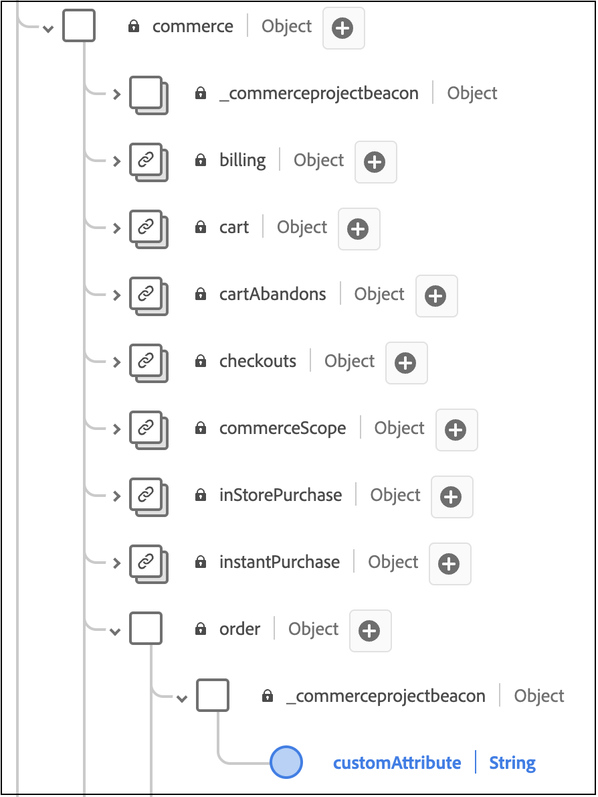

# 添加自定义订单属性

在本文中，您将了解如何向后台事件添加自定义属性。 通过自定义属性，您可以捕获丰富的数据见解以增强分析并进而为购物者创建个性化体验。

自定义属性可在两个级别受支持：

- 订单级别
- 订单物料级别

>[!NOTE]
>
>Adobe[!DNL Commerce]支持数据类型为字符串、布尔值或日期的自定义属性。

将自定义属性添加到Back Office事件要求您：

1. 在[!DNL Commerce]安装中创建项目。
1. 更新您的架构，以便新的自定义属性可以正确引入Experience Platform。
1. 在Admin中，确认正在捕获自定义属性并将其发送到Experience Platform。

>[!IMPORTANT]
>
>下面的目录结构和代码示例说明了如何实施自定义属性。 所需的实际目录结构和代码取决于存储配置和环境。

## 步骤1：创建目录结构

1. 导航到[!DNL Commerce]安装中的`app/code`目录并创建模块目录。 例如： `Magento/AepCustomAttributes`。 此目录包含自定义属性所需的文件。
1. 在模块目录中，创建一个名为`etc`的子目录。 `etc`目录包含`module.xml`、`query.xml`、`di.xml`和`et_schema.xml`文件。

## 步骤2：定义依赖项和设置版本

创建定义依赖项和安装版本的`module.xml`文件。 例如：

```xml
<?xml version="1.0"?>
<!--
/**
* Copyright (c) [year], [name]. All rights reserved.
*/
-->
<config xmlns:xsi="http://www.w3.org/2001/XMLSchema-instance" xsi:noNamespaceSchemaLocation="urn:magento:framework:Module/etc/module.xsd">
    <module name="Magento_SalesRuleStaging" setup_version="2.0.0">
        <sequence>
            <module name="Magento_Staging"/>
            <module name="Magento_SalesRule"/>
        </sequence>
    </module>
</config>
```

## 步骤3：检索销售订单数据

创建检索销售订单数据的`query.xml`文件。 例如：

```xml
<query>
    <source name="sales_order" type="sales">
        <attribute name="increment_id" operator="eq" alias="order_increment_id"/>
        <link source="inventory_source_item" condition_type="by_sku"/>
    </source>
</query>
```

## 步骤4：设置依赖项注入

创建用于设置依赖项注入的`di.xml`文件。 例如：

```xml
<manifest xmlns:android="http://schemas.android.com/apk/res/android"
          package="com.example.instrumentedtest"
          android:versionCode="1"
          android:versionName="1.0">
    <uses-sdk android:minSdkVersion="8" android:targetSdkVersion="15"/>
    
    <instrumentation
        android:name=".MyInstrumentationTestRunner"
        android:targetPackage="com.example.instrumentedtest"/>
    
    <!-- More instrumentation elements might be here -->
</manifest>
```

## 步骤5：定义用于依赖项注入的服务

创建一个`et_schema.xml`文件，该文件定义用于依赖项注入的服务。 例如：

```xml
<services>
    <service id="App\Controller\MainController" class="App\Controller\MainController">
        <argument type="service" id="doctrine.orm.default_entity_manager"/>
        <argument type="service" id="form.factory"/>
        <argument type="service" id="security.authorization_checker"/>
    </service>

    <!-- ... -->

    <service id="App\Controller\SecurityController" class="App\Controller\SecurityController">
        <argument type="service" id="security.authentication_utils"/>
        <tag name="controller.service_arguments"/>
    </service>

    <!-- ... -->
</services>
```

## 步骤6：为PHP文件创建目录

在与`etc`目录相同的级别，创建一个名为`Module/Provider`的目录。 此目录包含`OrderCustomAttributes`和`OrderItemCustomAttributes` PHP文件。

## 步骤7：定义OrderCustomAttributes

创建定义顺序自定义属性的`OrderCustomAttributes.php`文件。 例如：

```php
namespace App\Transformers;

use League\Fractal\TransformerAbstract;
use Illuminate\Support\Collection;

class CustomAttributeTransformer extends TransformerAbstract
{
    protected $availableIncludes = [];
    protected $defaultIncludes = [];

    public function __construct($signsField, $jsonSignsField = null)
    {
        $this->signsField = $signsField;
        $this->jsonSignsField = $jsonSignsField;
    }

    public function transform(Collection $collection)
    {
        // Initialize array for additional information.
        $additionalInformation = [];

        // Source - this comes from values sent to this transformer.
        foreach ($collection->{$this->signsField} ?: [] as $value) {
            if (is_array($value)) {
                // If value is an array, serialize it.
                foreach ($value as &$item) {
                    if (isset($item['custom_attr'])) {
                        // Serialize custom attribute data.
                        ...
                    }
                }
            } else {
                // Add non-array values directly.
                ...
            }
        }

        ...

        return [
            'current' => ...,
            'additional_information' => ...,
            'source' => ...,
        ];
    }

    private function flatten(array $values)
    {
      return Arr::flatten($values);
  }
}
```

## 步骤8：定义OrderItemCustomAttributes

创建定义订单项自定义属性的`OrderItemCustomAttributes.php`文件。 例如：

```php
namespace Magento\AepCustomAttributes\Model\Provider;

use Magento\Framework\Serialize\Serializer\Json;

class OrderItemCustomAttribute
{
    private Json $jsonSerializer;
    private string $usingField;

    public function __construct(Json $jsonSerializer, string $usingField)
    {
        $this->jsonSerializer = $jsonSerializer;
        $this->usingField = $usingField;
    }

    public function get(array $values): array
    {
        $output = [];
        $values = $this->flatten($values);

        foreach ($values as $row) {
            $info = \is_string($row['additionalInformation']) ? $row['additionalInformation'] : '{}';
            $unserializedData = $this->jsonSerializer->unserialize($info) ?? [];

            $attrLabel = implode(',', ['label1', 'label2']);
            $unserializedData['custom_attr1'] = $attrLabel;

            $additionalInformation = [];
            foreach ($unserializedData as $name => $value) {
                $additionalInformation[] = [
                    'name' => $name,
                    'value' => \is_string($value) ? $value : $this->jsonSerializer->serialize($value),
                ];
            }

            foreach ($additionalInformation as $information) {
                $output[] = [
                    'additionalInformation' => $information,
                    $this->usingField => $row[$this->usingField],
                ];
            }
        }

        return $output;
    }

    private function flatten(array $values): array
    {
        return array_merge([], ...array_values($values));
    }
}
```

## 步骤9：为productContext文件创建目录

在与`etc`目录相同的级别，创建一个名为`Plugin/Module`的目录。 此目录包含`ProductContext.php`文件。

## 步骤10：定义ProductContext类

创建名为`ProductContext.php`的文件，该文件定义`ProductContext`类。 例如：

```php
namespace Magento\Catalog\Model\Product;

use Magento\Framework\App\ResourceConnection;
use Magento\Quote\Api\Data\CartInterface;

class ProductContext
{
    private $brandCache = [];
    private $resourceConnection;

    public function __construct(
        ResourceConnection $resourceConnection
    ) {
        $this->resourceConnection = $resourceConnection;
    }

    public function afterGetProductData($subject, array $result)
    {
        if (isset($result['brand_id'])) {
            if (!isset($this->brandCache[$result['brand_id']])) {
                // @todo load brand label by brand id.
                $this->brandCache[$result['brand_id']] = 'Brand Label ' . $result['brand_id'];
            }
            $result['brands'] = ['label' => $this->brandCache[$result['brand_id']]];
        }

        return $result;
    }
}
```

## 步骤11：注册模块

在与`etc`目录相同的级别，创建注册模块的`registration.php`文件。 例如：

```php
use \Magento\Framework\Component\ComponentRegistrar;

ComponentRegistrar::register(
    ComponentRegistrar::MODULE,
    'Dfe_Stripe',
    __DIR__
);
```

## 步骤12：扩展现有XDM架构

要确保Experience Platform中的[!DNL Commerce]架构能够摄取新的自定义订单属性，您需要扩展架构以包含这些自定义字段。

要了解如何扩展现有XDM架构以包含这些自定义字段，请参阅Experience Platform文档中的[在UI中创建和编辑架构](https://experienceleague.adobe.com/en/docs/experience-platform/xdm/ui/resources/schemas#custom-fields-for-standard-groups)一文。 租户ID字段是动态生成的；但是，字段结构应类似于Experience Platform文档中提供的示例。

>[!IMPORTANT]
>
>XDM自定义属性必须与从[!DNL Commerce]发送的属性匹配。

到`commerce.order`，为订单级别添加字段：



到`productListItems`，为订单项级别添加字段：


## 步骤12：确认正在捕获数据

查看管理员中的[数据自定义](connect-data.md#data-customization)选项卡，以确认正在捕获自定义属性数据并将其发送到Experience Platform。

### 故障排除

如果您在&#x200B;**[!UICONTROL Data Customization]**&#x200B;选项卡上看到消息`No custom order attributes found.`，请确认以下事项：

1. 您已完成启用[Data Connector扩展](overview.md#prerequisites)的先决条件。
1. 您已配置[自定义订单属性](#add-custom-order-attributes)。
1. 至少已生成一个订单事件。
