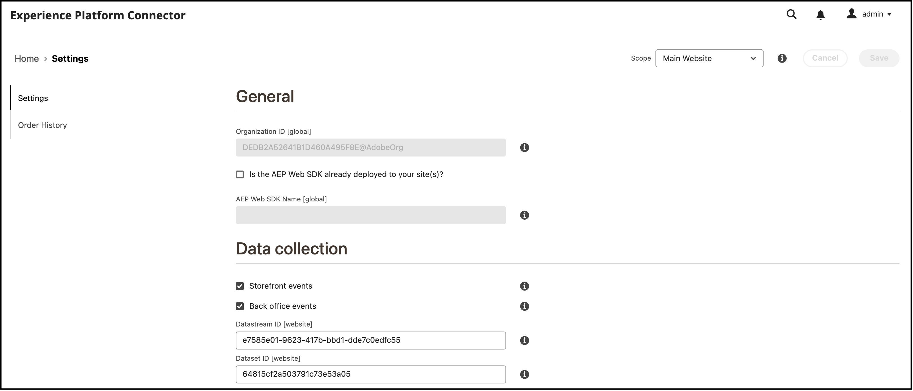

# 将Commerce数据连接到Adobe Experience Platform

安装Experience Platform连接器时，中会显示两个新的配置页面 **系统** 下的菜单 **服务** 在商业中 _管理员_.

- Commerce服务连接器
- Experience Platform连接器

要将Adobe Commerce实例连接到Adobe Experience Platform，必须配置这两个连接器，首先是Commerce Services连接器，然后是Experience Platform连接器。

## 更新Commerce服务连接器

如果以前安装过Adobe Commerce服务，则您可能已配置Commerce Services连接器。 如果没有，则必须在 [Commerce服务连接器](../landing/saas.md) 页面：

1. 登录到您的Commerce帐户以 [检索您的生产和沙盒API密钥](../landing/saas.md#credentials).
1. 选择 [SaaS数据空间](../landing/saas.md#saas-configuration).
1. 登录到您的Adobe帐户以 [检索您的组织ID](../landing/saas.md#ims-organization-optional).

配置Commerce Services连接器后，再配置Experience Platform连接器。

## 更新Experience Platform连接器

在此部分中，您可以使用组织ID将Adobe Commerce实例连接到Adobe Experience Platform。 然后，您可以指定要发送到Experience Platform边缘的数据类型 — 店面和后台。



## 常规

1. 在“管理员”中，转到 **系统** >服务> **Experience Platform连接器**.

1. 在 **设置** 选项卡在 **常规**，验证与您的Adobe Experience Platform帐户关联的ID，如在中配置 [Commerce服务连接器](../landing/saas.md#organizationid). 组织ID是全局的。 每个Adobe Commerce实例只能关联一个组织ID。

1. 在 **范围** 下拉列表，将上下文设置为 **网站**.

1. （可选）如果您已经拥有 [AEP Web SDK（合金）](https://experienceleague.adobe.com/docs/experience-platform/edge/home.html) 部署到您的站点时，启用该复选框并添加AEP Web SDK的名称。 否则，请将这些字段留空，Experience Platform连接器会为您部署一个插件。

   >[!NOTE]
   >
   >如果您指定自己的AEP Web SDK，Experience Platform连接器将使用与该SDK关联的数据流ID，而不是此页中指定的数据流ID（如果有）。

## 数据收集

在此部分中，您可以指定要发送到Experience Platform边缘的数据类型。 有两种类型的数据：客户端和服务器端。

客户端数据是在店面中捕获的数据。 这包括购物者交互，例如 `View Page`， `View Product`， `Add to Cart`、和 [申请列表](events.md#b2b-events) 信息（对于B2B商家）。 服务器端数据（或后台数据）是在Commerce服务器中捕获的数据。 这包括有关订单状态的信息，例如订单是否已下达、已取消、已退款、已发运或已完成。

要确保Adobe Commerce实例可以开始数据收集，请查看 [先决条件](overview.md#prerequisites).

请参阅活动主题以了解有关 [店面](events.md#storefront-events) 和 [后台](events.md#back-office-events) 事件。

>[!NOTE]
>
>中的所有字段 **数据收集** 部分适用于 **网站** 范围或更高。

1. 选择 **店面活动** 如果您要发送店面行为数据。

   >[!NOTE]
   >
   >此 **店面活动** 如果AEP Web SDK和组织ID有效，则会自动启用复选框。

1. 选择 **后台活动** 如果您要发送订单状态信息（例如，订单是否已下达、已取消、已退款或已发运）。

   >[!NOTE]
   >
   >如果您选择 **后台活动**，所有后台数据都会发送到Experience Platform边缘。 如果购物者选择退出数据收集，您必须在Experience Platform中明确设置购物者的隐私偏好设置。 这与店面事件不同，店面事件收集器已根据购物者偏好处理同意。 [了解详情](https://experienceleague.adobe.com/docs/experience-platform/landing/governance-privacy-security/consent/adobe/dataset.html) 关于在Experience Platform中设置购物者的隐私首选项。

1. 确保后台事件数据根据计划更新 [cron](https://experienceleague.adobe.com/docs/commerce-admin/systems/tools/cron.html) 作业，您必须更改 `Sales Orders Feed` 索引目标 `Update by Schedule`.

   1. 在 _管理员_ 侧栏，转到 **[!UICONTROL System]** > _[!UICONTROL Tools]_>**[!UICONTROL Index Management]**.

   1. 选中复选框 `Sales Orders Feed` 索引器。

   1. 设置 **[!UICONTROL Actions]** 到 `Update by Schedule`.

   1. 如果您是首次启用后台数据，请运行以下命令来重新索引并触发重新同步。 只要 [cron](https://experienceleague.adobe.com/docs/commerce-admin/systems/tools/cron.html) 作业设置正确。

      ```bash
      bin/magento index:reindex sales_order_data_exporter_v2
      ```

      ```bash
      bin/magento saas:resync --feed orders
      ```

1. （如果您使用自己的AEP Web SDK，请跳过此步骤。） [创建](https://experienceleague.adobe.com/docs/experience-platform/edge/datastreams/configure.html#create) Adobe Experience Platform中的数据流，或者选择要用于收集的现有数据流。

1. （如果您使用自己的AEP Web SDK，请跳过此步骤。） 在 **数据流ID** 字段中，粘贴该新数据流或现有数据流的ID。

## 字段描述

| 字段 | 描述 |
|--- |--- |
| 范围 | 您希望应用配置设置的特定网站。 |
| 组织ID（全局） | 属于购买AdobeDX产品的组织的ID。 此ID可将您的Adobe Commerce实例链接到Adobe Experience Platform。 |
| AEP Web SDK是否已部署到您的站点 | 如果您已将自己的AEP Web SDK部署到站点，请选中此复选框 |
| AEP Web SDK名称（全局） | 如果您已将一个Experience PlatformWeb SDK部署到您的站点，请在此字段中指定该SDK的名称。 这允许Storefront事件收集器和店面事件SDK使用您的Experience PlatformWeb SDK，而不是Experience Platform连接器部署的版本。 如果您没有将Experience PlatformWeb SDK部署到网站，请将此字段留空，Experience Platform连接器会为您部署一个。 |
| 店面活动 | 只要组织ID和数据流ID有效，默认情况下都会选中。 店面活动在购物者浏览您的网站时收集他们的匿名行为数据。 |
| 后台活动 | 如果选中，则事件有效负荷包含匿名的订单状态信息，例如订单是否已下达、取消、退款或发运。 |
| 数据流ID（网站） | 允许数据从Adobe Experience Platform流向其他AdobeDX产品的ID。 此ID必须关联到您的特定Adobe Commerce实例中的特定网站。 如果您指定自己的Experience PlatformWeb SDK，请不要在此字段中指定数据流ID。 Experience Platform连接器使用与该SDK关联的数据流ID，并忽略在此字段中指定的任何数据流ID（如果有）。 |

>[!NOTE]
>
>完成新用户引导后，店面数据开始流入Experience Platform边缘。 后台数据大约需要5分钟才能显示在边缘。 根据cron时间表，可以在Edge看到后续更新。

## (Beta)发送历史订单数据

>[!NOTE]
>
>此功能仅适用于Beta版用户。 您可以通过向以下地址发送电子邮件来加入测试版： [dataconnection@adobe.com](mailto:dataconnection@adobe.com).

Adobe Commerce会收集长达五年的历史订单数据和状态。 您可以使用Experience Platform连接器将该历史数据发送到Experience Platform，以根据这些过去的订单扩充您的客户配置文件。 该数据存储在Experience Platform内的数据集中。

虽然Commerce已收集历史订单数据，但您必须完成几项任务才能将该数据发送给Experience Platform。 以下部分将指导您完成此过程。

### 安装历史订单测试版

要为测试版启用历史订单数据收集，您必须更新项目的根 [!DNL Composer] `.json` 文件如下所示：

1. 打开根 `composer.json` 文件和搜索 `magento/experience-platform-connector`.

1. 在 `require` 部分，按如下方式更新版本号：

   ```json
   "require": {
      ...
      "magento/experience-platform-connector": "^3.0.0-beta1",
      ...
    }
   ```

1. 对于B2B商家，请更新 `.json` 文件如下所示：

   ```json
   "require": {
     ...
     "magento/experience-platform-connector-b2b": "^2.0.0-beta1"
     ...
   }
   ```

1. **保存** `composer.json`. 然后，从命令行运行以下命令：

   ```bash
   composer update magento/experience-platform-connector –-with-dependencies
   ```

   或者，对于B2B商家：

   ```bash
   composer update magento/experience-platform-connector-b2b --with-dependencies
   ```

### 配置历史订单测试版

为确保将客户的订单历史记录发送到Experience Platform，您必须指定将您的Commerce实例链接到Experience Platform的凭据。 如果您已安装并启用了 [Audience Activation](https://experienceleague.adobe.com/docs/commerce-admin/customers/audience-activation.html) 扩展上，您已指定所需的凭据，可以跳过此步骤。 如果尚未安装和启用Audience Activation扩展，请完成以下步骤：

>[!NOTE]
>
>在此部分中，您从开发人员控制台输入凭据。 确保您的开发人员控制台项目具有正确的 [配置的角色和权限](https://experienceleague.adobe.com/docs/experience-platform/landing/platform-apis/api-authentication.html#assign-api-to-a-role).

1. 在 _管理员_ 侧栏，转到 **[!UICONTROL Stores]** > _[!UICONTROL Settings]_>**[!UICONTROL Configuration]**.

1. 展开 **[!UICONTROL Services]** 并选择 **[!UICONTROL Experience Platform Connector]**.

1. 输入可在中找到的配置凭据 [开发人员控制台](https://developer.adobe.com/console/home).

   {width="700" zoomable="yes"}

   >[!NOTE]
   >
   >对于测试版，Commerce在开发人员控制台中使用JSON Web令牌(JWT)凭据。 测试后，Commerce将在开发人员控制台中使用OAuth 2.0。

1. 单击 **保存配置**.

### 设置订单同步服务

输入开发人员凭据后，即可设置订单同步服务。 订单同步服务使用 [消息队列框架](https://developer.adobe.com/commerce/php/development/components/message-queues/) 和RabbitMQ。 完成这些步骤后，订单状态数据可以同步到SaaS，在发送到Experience Platform之前需要执行此操作。

1. [启用](https://experienceleague.adobe.com/docs/commerce-cloud-service/user-guide/configure/service/rabbitmq.html) RabbitMQ。

   >[!NOTE]
   >
   >已为Commerce版本2.4.7及更高版本设置了RabbitMQ，但您必须启用消费者。

1. 在中通过cron作业启用消息队列使用者 `.magento.env.yaml` 使用 `CRON_CONSUMERS_RUNNER` 环境变量。

   ```yaml
      stage:
        deploy:
          CRON_CONSUMERS_RUNNER:
            cron_run: true
   ```

   >[!NOTE]
   >
   >请参阅 [部署变量文档](https://experienceleague.adobe.com/docs/commerce-cloud-service/user-guide/configure/env/stage/variables-deploy.html#cron_consumers_runner) 了解所有可用的配置选项。

启用订单同步服务后，您可以在Experience Platform连接器页面中指定历史订单日期范围。

### 指定订单历史记录日期范围

在此部分中，您可以指定要发送给Experience Platform的历史订单的日期范围。

{width="700" zoomable="yes"}

1. 在“管理员”中，转到 **系统** >服务> **Experience Platform连接器**.

1. 选择 **订单历史记录** 选项卡。

1. 下 **订单历史记录同步**，输入 **数据集Id**. 这应该是与您在中指定的数据流关联的数据集 [数据收集](#data-collection) 部分。

   1. 要访问数据集ID，请打开Experience PlatformUI并选择 **数据集** 在左侧导航栏中打开 **数据集** 仪表板。 仪表板列出您组织的所有可用数据集。 将显示每个列出数据集的详细信息，包括其名称、数据集所遵循的架构以及最近一次摄取运行的状态。
   1. 打开与数据流关联的数据集。
   1. 在右侧窗格中，您将看到有关数据集的详细信息。 复制数据集ID。

   {width="700" zoomable="yes"}

1. 在 **从** 和 **至** 字段为要发送的历史订单数据指定数据范围。 您不能选择超过五年的日期范围。

1. 选择 [!UICONTROL Start Sync] 以触发同步开始。 历史订单数据是批处理数据，而不是店面和后台的流数据。 批量数据大约需要45分钟才能到达Experience Platform。

   >[!NOTE]
   >
   >对于测试版，如果在同一或重叠时间范围内多次触发同步，您会在数据集中看到重复的事件。

## 确认已收集事件数据

要确认从Commerce商店收集数据，请使用 [Adobe Experience Platform debugger](https://experienceleague.adobe.com/docs/experience-platform/debugger/home.html) 以检查您的Commerce网站。 确认正在收集数据后，您可以通过运行一个查询来验证您的店面和后台事件数据是否显示在边缘，该查询会返回以下位置的数据： [您创建的数据集](overview.md#prerequisites).

1. 选择 **查询** 在Experience Platform的左侧导航区域中，然后单击 [!UICONTROL Create Query].

   

1. 当查询编辑器打开时，输入从数据集选择数据的查询。

   

   例如，您的查询可能如下所示：

   ```sql
   SELECT * from `your_dataset_name` ORDER by TIMESTAMP DESC
   ```

1. 查询运行后，结果将显示在 **结果** 选项卡，在 **控制台** 选项卡。 此视图显示查询的表格输出。

   

在此示例中，您会看到以下源自 [`commerce.productListAdds`](events.md#addtocart)， [`commerce.productViews`](events.md#productpageview)， [`web.webpagedetails.pageViews`](events.md#pageview)，等等。 利用此视图，可验证您的Commerce数据是否到达边缘。

如果结果不符合预期，请打开您的数据集并查找任何失败的批量导入。 了解有关 [批处理导入疑难解答](https://experienceleague.adobe.com/docs/experience-platform/ingestion/batch/troubleshooting.html).
