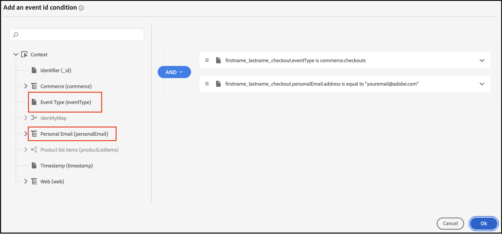
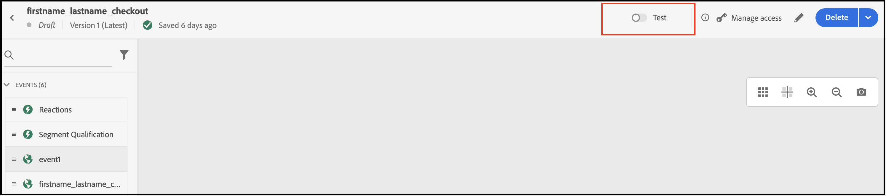

# 使用Adobe Journey Optimizer发送放弃的购物车电子邮件

[Adobe Journey Optimizer](https://experienceleague.adobe.com/docs/journey-optimizer/using/get-started/get-started.html) 帮助您为购物者打造个性化的商业体验。 例如，您可以使用Journey Optimizer创建和投放计划的营销活动，如零售商店的每周促销活动，或者，如果客户将产品添加到购物车，但未完成结账过程，则生成放弃的购物车电子邮件。

通过执行以下步骤，您可以了解如何监听 `checkout` 从Commerce实例生成的事件并在Journey Optimizer中响应该事件以生成弃用的购物车电子邮件。

>[!IMPORTANT]
>
>出于演示目的，请确保您使用的是Commerce沙盒环境。 这可确保您发送到Experience Platform的店面和后台事件数据不会稀释生产事件数据。

## 先决条件

在开始这些步骤之前，请确保：

- 您已配置为使用Adobe Journey Optimizer
- 您 [已配置](connect-data.md) Experience Platform连接器
- 您 [已确认](connect-data.md#confirm-that-event-data-is-collected) 您的Commerce事件数据将到达Experience Platform边缘

## 步骤1：在Commerce沙盒环境中创建用户

在您的沙盒环境中创建一个用户，并确认用户帐户信息显示在Experience Platform中。 请确保您指定的电子邮件有效，因为稍后在此部分中会使用该电子邮件发送放弃的购物车电子邮件。

1. 在您的Commerce沙盒环境中登录或创建帐户。

   {width="700" zoomable="yes"}

   安装并配置Experience Platform连接器后，此帐户信息将作为用户档案发送到Experience Platform。

1. 确认您的用户帐户信息显示在 **[!UICONTROL Profile]** 部分Experience Platform。

   转到 **[!UICONTROL Profiles]** 在Adobe Experience Platform中。 单击 **[!UICONTROL Detail]** ，查看您创建的配置文件。

   {width="700" zoomable="yes"}

## 步骤2：在Journey Optimizer中查看事件

在您的Commerce沙盒环境中，查看产品页面、将项目添加到购物车以及购物者可以执行的各种其他活动。 这些活动会触发您店面上的事件。 现在，您可以确认这些事件是否正流入Journey Optimizer。

1. Launch [Adobe Journey Optimizer](https://experienceleague.adobe.com/docs/journey-optimizer/using/get-started/user-interface.html).
1. 选择 **[!UICONTROL Profiles]**.
1. 设置 **[!UICONTROL Identity namespace]** 到 `Email`.
1. 设置 **[!UICONTROL Identity value]** 到您的电子邮件地址。
1. 选择您的个人资料，然后选择 **[!UICONTROL Events]** 选项卡。

   {width="700" zoomable="yes"}

   查找 `commerce.checkouts` 事件并检查事件有效负载：

       “&#39;json
       &quot;personID&quot;： &quot;84281643067178465783746543501073369488&quot;，
       &quot;eventType&quot;： &quot;commerce.checkouts&quot;，
       “_id”：“4b41703f-e42e-485b-8d63-7001e3580856-0”，
       &quot;commerce&quot;： {
       &quot;cart&quot;： {}，
       “结帐”： {
       &quot;value&quot;： 1
       }
       ```
   
   如您所见，完整的事件有效负载包含丰富的事件数据。 在下一部分中，您将配置Journey Optimizer中的事件以侦听和响应 `commerce.checkouts` 事件从Commerce店面生成。

## 步骤3：在Journey Optimizer中配置事件

在Journey Optimizer中配置两个事件：一个事件监听 `commerce.checkouts` 事件，另一个是基本超时事件，需要等待一段时间才能触发放弃的购物车电子邮件。

### 创建监听程序事件

1. Launch [Adobe Journey Optimizer](https://experienceleague.adobe.com/docs/journey-optimizer/using/get-started/user-interface.html).

1. 单击 **[!UICONTROL Configurations]** 在 **[!UICONTROL Administration]** 部分。

1. 在 **[!UICONTROL Events]** 图块，单击 **[!UICONTROL Manage]**.

   {width="700" zoomable="yes"}

1. 在 **[!UICONTROL Events]** 页面，单击 **[!UICONTROL Create Event]**.

1. 在右侧导航中，按如下方式设置您的事件：

   1. 设置 **[!UICONTROL Name]** 至： `firstname_lastname_checkout`.
   1. 设置 **[!UICONTROL Type]** 到 **[!UICONTROL Unitary]**.
   1. 设置 **[!UICONTROL Event id typ]e** 到 **[!UICONTROL Rule based]**.
   1. 设置 **[!UICONTROL Schema]** 至您的商务 [架构](update-xdm.md).
   1. 选择 **[!UICONTROL Fields]** 和 **[!UICONTROL Fields]** 页面上，选择对此事件有用的字段。

      例如，选择 **[!UICONTROL Product list items]**， **[!UICONTROL Commerce]**， **[!UICONTROL eventType]**、和 **[!UICONTROL Web]**.

   1. 单击 **[!UICONTROL OK]** 以保存选定的字段。
   1. 单击内部 **[!UICONTROL Event id condition]** 字段并创建条件 `eventType` 等于 `commerce.checkouts` 和 `personalEmail.address` 等于在上一部分中创建用户档案时使用的电子邮件地址。

      {width="700" zoomable="yes"}

   1. 单击 **[!UICONTROL OK]**.
   1. 单击 **[!UICONTROL Save]** 以保存您的事件。

### 创建超时事件

1. 像之前一样在Journey Optimizer中创建事件。

1. 在右侧导航中，按如下方式设置您的事件：

   1. 设置 **[!UICONTROL Name]** 至： `firstname_lastname_timeout`.
   1. 设置 **[!UICONTROL Type]** 到 **[!UICONTROL Unitary]**.
   1. 设置 **[!UICONTROL Event id typ]e** 到 **[!UICONTROL Rule based]**.
   1. 设置 **[!UICONTROL Schema]** 至您的商务 [架构](update-xdm.md).
   1. 设置 **[!UICONTROL Schema]**， **[!UICONTROL Fields]**、和 **[!UICONTROL Event id condition]** 与上面相同。
   1. 单击 **[!UICONTROL Save]** 以保存您的事件。

配置这两个事件后，创建一个历程，以发送放弃的购物车电子邮件。

## 步骤4：构建结账历程

创建监听 `commerce.checkouts` 事件，然后在过了指定的时间后发送放弃的购物车电子邮件。

1. 在Journey Optimizer中，选择 **[!UICONTROL Journeys]** 下 **J[!UICONTROL OURNEY MANAGEMENT]**.
1. 单击 **[!UICONTROL Create Journey]**.
1. 指定历程的名称。
1. 单击 **[!UICONTROL OK]** 以保存历程。
1. 在左侧导航中的 **[!UICONTROL EVENTS]** 部分，搜索您之前创建的签出事件： `firstname_lastname_checkout` 然后将其拖放到画布上。

   >[!TIP]
   >
   >双击事件会自动将其添加到画布。

1. 搜索超时事件并将其添加到画布。
1. 双击超时事件。

   1. 在 **[!UICONTROL Timeout]** 部分，选择 **[!UICONTROL Define the event time]** 复选框。
   1. 在 **[!UICONTROL Wait for]** 字段输入 `1` 和 `Minute`.
   1. 选择 **[!UICONTROL Set a timeout path]** 复选框。

   使用此超时配置，执行结账但未在一分钟内完成订单的购物者将触发此超时分支。 在实际生产环境中，您需要设置更长的时间段，如24小时。

1. 在左侧导航中，位于 **[!UICONTROL ACTIONS]**，添加 **[!UICONTROL Email]** 超时分支的操作。 您的历程应如下所示：

   {width="700" zoomable="yes"}

### 创建放弃的购物车电子邮件

创建在检测到放弃的购物车时发送的放弃的购物车电子邮件。

1. 在上面创建的历程中，双击 **[!UICONTROL Email]** 图标。

1. 请遵循 [步骤](https://experienceleague.adobe.com/docs/journey-optimizer/using/content-management/personalization/personalization-use-cases/personalization-use-case-helper-functions.html#configure-email) Journey Optimizer ，以创建放弃的购物车电子邮件。

现在，您有一个在Journey Optimizer中收听 `commerce.checkouts` Commerce商店中的事件以及在一段时间后发送的放弃的购物车电子邮件。 在下一部分中，您将测试旅程。

## 步骤5：实时触发签出事件

在此部分中，您将实时测试事件。

1. 在Journey Optimizer中，切换测试模式。

   {width="700" zoomable="yes"}

1. 要实时测试此历程，请打开另一个浏览器选项卡，然后转到您的沙盒Commerce网站。

   1. 将产品添加到购物车。
   1. 转到结帐页面。
   1. 在结账页面中，通过返回主页或关闭选项卡来放弃购物车。

      旅程现在会触发。 要进行确认，请在Journey Optimizer中打开包含您的旅程的选项卡。 您应该会看到一个绿色箭头，其中显示用户经历的路径。

1. 检查收件箱中的电子邮件。
