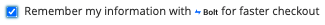

# [!DNL Express Checkout] 流量

>[!IMPORTANT]
>
> 该功能仅面向提前采纳者计划(EAP)用户，并且尚未可供所有客户访问。 目前仅限于美国客户。 如需帮助和问题，请联系Adobe Commerce支持。

本节概述了使用 [!DNL Express Checkout] (对于Adobe Commerce扩展)。

成功 [!DNL Express Checkout] 流程包含以下步骤：

1. 打开店面，并在购物车中添加商品。
1. 继续结帐。

1. 出现提示时，输入与Bolt帐户关联的电子邮件地址。
1. 输入发送到该Bolt帐户的电子邮件地址或电话号码的一次性密码(OTP)。
1. 使用Bolt帐户登录后，结帐详细信息会自动填写：

   - 装运信息
   - 付款方法

   >[!NOTE]
   >
   > 即使您的结账详细信息已自动填写，您也可以使用现有的钱包信息（地址或信用卡信息）。

1. 下单。

的 [!DNL Express Checkout] 与标准的其他Adobe Commerce结账选项(例如 [礼品卡](https://docs.magento.com/user-guide/catalog/product-gift-card.html) 或 [折扣代码](https://docs.magento.com/user-guide/marketing/price-rules-cart-coupon.html).

## [!DNL Express Checkout] 用例

的 [!DNL Express Checkout] 允许在结帐流程期间使用多个用例：

- 具有注册Bolt帐户的来宾用户。
- 具有新Bolt帐户的来宾用户。
- 已注册/未注册Bolt帐户的现有Adobe Commerce用户。

## 来宾用户结账：工作原理

来宾结帐体验与已登录的体验不同。 当购物者输入进入结账的电子邮件地址时， [!DNL Express Checkout] 验证以查找现有Bolt帐户。

### 已注册的螺栓帐户

如果找到Bolt帐户，购物者将继续使用 [!DNL Express Checkout] 无缝结账体验：

1. 根据Bolt帐户中用户的偏好，输入发送到该Bolt帐户的电子邮件地址或移动设备的一次性密码(OTP)。
1. 使用Bolt帐户登录后，它会自动填写结帐详细信息：

   - 装运信息
   - 付款方法

1. 下单。

>[!TIP]
>
> 来宾用户将下订单，并可在Adobe Commerce中注册。

### 新建Bolt帐户

如果未找到Bolt帐户，购物者将继续其默认的现成Adobe Commerce结账，购物者将提供所有必需的详细信息以下订单：

- 运输和账单信息
- 装运方法
- 复核付款方法
- 此时会出现一个复选框，用于在下订单之前在Bolt中注册以加快结帐。 他们可以同意创建其Bolt帐户的条款和条件。

   

- 来宾用户下订单，并可在Adobe Commerce中注册。

## 现有Adobe Commerce用户：工作原理

现有用户在使用 [!DNL Express Checkout] 更快的结帐体验。

当购物者输入进入结账的电子邮件地址时， [!DNL Express Checkout] 验证以查找现有Bolt帐户。

### 已向Adobe Commerce用户注册的Bolt帐户

如果找到Bolt帐户，购物者将继续其默认的现成Adobe Commerce结账，购物者将提供所有必需的详细信息，然后下订单：

- 运输和账单信息
- 装运方法
- 复核付款方法

请参阅 [疑难解答](../express-checkout/troubleshooting.md) 主题。

>[!NOTE]
>
> 如果用户具有Bolt帐户，并且电子邮件未在Adobe Commerce中显示为已注册，则会触发一次性密码(OTP)登录。 请参阅 [注册的螺栓帐户](#registered-bolt-account) 流量。

### 新建Bolt帐户

如果未找到Bolt帐户，购物者将继续其默认的Adobe Commerce结账，购物者则从其保存的信息中选择所有必需的详细信息以下订单：

- 运输和账单信息
- 装运方法
- 复核付款方法
- 此时会出现一个复选框，用于在下订单之前在Bolt中注册以加快结帐。 他们可以同意创建其Bolt帐户的条款和条件。

   

## 获取帮助

如需帮助和问题，请联系Adobe Commerce支持。
