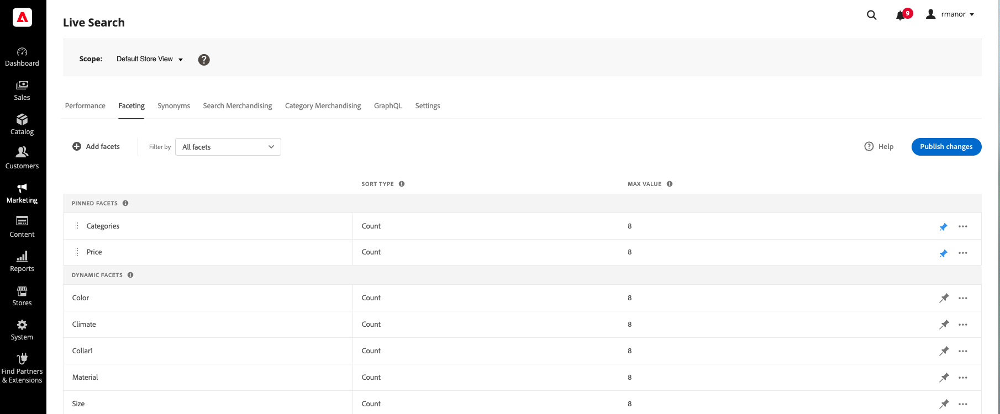

# 彩块化工作区

此 *彩块化* 工作区列出了当前可用的所有Facet，并允许访问设置和管理Facet所需的工具。 固定多面首先出现在现有Facet列表中，然后是动态Facet。 可以对列表进行过滤，以显示所有方面，或仅显示固定或动态方面。

## 设置范围

如果您的Adobe Commerce安装包含多个商店视图，请设置 **范围** 到 [商店视图](https://experienceleague.adobe.com/docs/commerce-admin/start/setup/websites-stores-views.html#scope-settings) 您的Facet设置适用的位置。

## 筛选列表

1. 单击 **过滤方式** 控制。
1. 选择下列选项之一：

   * 所有筛选器
   * 已固定
   * 动态

## 添加方面

1. 单击 **添加Facet**.
1. 请参阅 [添加Facet](facets-add.md) 以获取详细说明。

## 列描述

| 列 | 描述 |
|--- |--- |
| （第一列） | 按列固定和动态Facet [标签](facets-type.md) 对购物者可见。 |
| 排序类型 | 此 [排序顺序](facets-type.md) Facet值。 Facet按字母顺序排序所有 [!DNL Commerce] 店面。 对象 [headless] 实施，Facet可以按字母顺序或计数排序。 选项：按字母顺序、计数（仅限Headless） |
| 最大值 | 店面中作为过滤器可用的Facet值的数量，最大为10。 |

## 控件

| 控件 | 描述 |
|--- |--- |
| 添加Facet | 打开 [Facet编辑器](facets-add.md). |
| 过滤方式 | 确定 [Facet类型](facets-type.md) 显示在列表中的其他位置。 选项：全部、固定、动态 |
