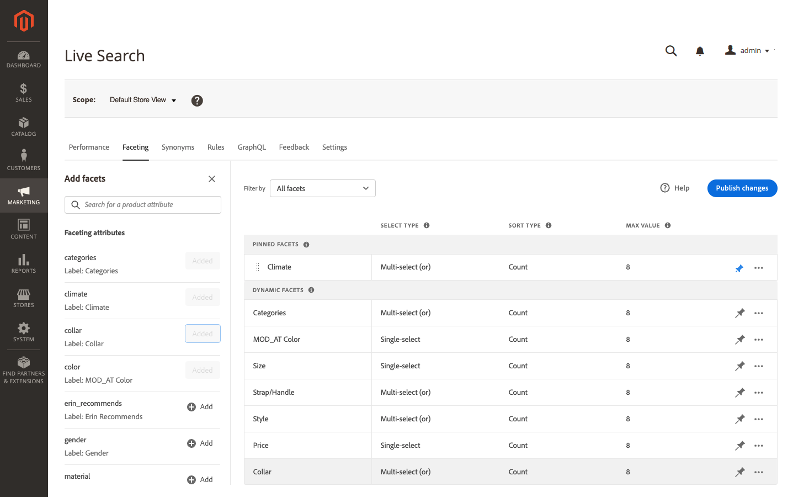

# 添加Facet

任何可过滤的产品属性均可用作Facet。 的 *添加Facet* 面板会列出当前facet，并且可以轻松地将其他产品属性分配为facet。 在此三步过程中，选择属性作为Facet，根据需要编辑属性，并将更改发布到店面。

## 步骤1:添加facet

1. 在管理员中，转到 **营销** > SEO和搜索> **[!DNL Live Search]**.
1. 在 *分面* ，单击 **添加Facet**.
1. 在 *添加Facet* 列表中，每个可用属性都具有单独的 *添加* 按钮。 执行以下操作之一：

   

   * 在 *分面属性* 列表，选择要用作facet的产品属性并单击 **添加**.
   * 要查找特定的产品属性，请在 *搜索* 框中。 然后，单击 **添加**.

      要配置分段价格间隔和分组，请参阅 [设置](settings.md). 要了解更多信息，请转到 [面类型](facets-type.md).
该方面会添加到 *动态Facet* 列表和 *发布更改* 按钮将变为可用。
   

1. 如果找不到要添加的Facet，请转到 **商店** >属性> **产品** 并验证属性是否具有 [必需属性](facets.md) 用作面。 如有必要，请更新属性的以下店面属性：

   * 在搜索中使用 —  `Yes`
   * 在搜索结果中使用分层导航 —  `Yes`
   * 在分层导航中使用 —  `Filterable (with results)`

1. 出现提示时，刷新缓存。

   当目录下次与同步时，该面将在店面中变得可用 [!DNL Live Search]. 如果小平面在两小时后不可用，请参阅 [同步目录数据](install.md#synchronize-catalog-data).

## 步骤2:编辑Facet属性（可选）

1. 要编辑小平面属性，请单击 **更多** ()选项。
1. 在菜单中，单击 **编辑**. 然后，根据需要调整以下属性。

   * 标签 — ([无头](facets-type.md) （仅限）输入要使用的Facet标签。
   * 选择类型 —  *选择类型* 全部使用 [!DNL Commerce] 店面 `single select`. 对于无头实施， `multi-select` 类型可以分配逻辑运算符(`or` 或 `and`)来确定返回的产品集。
   * 排序类型 — Facet按字母顺序对所有 [!DNL Commerce] 店面。 对于无头实施，Facet可以按字母顺序或按计数进行排序。 选项：按字母顺序，计数（仅限无头）
   * 最大值 — 输入店面中显示的最大面值数。 有效条目：0-30;默认：8

1. 完成后，单击 **保存**.

   

1. 将小平面固定到 *过滤器* 列表，单击灰色的推销()。
1. 要更改被固定的面的顺序，请单击 **移动** ()图标，并将行拖到 *固定的Facet* 中。

## 步骤3:发布更改

1. 完成小平面后，单击 **发布更改**.
1. 等待商店中出现该面。
如果小平面在两小时后不可用，请参阅 [验证导出](install.md#synchronize-catalog-data) 中。

## 字段描述

| 字段 | 描述 |
|--- |--- |
| 标签 | ([无头](facets-type.md) 仅) [facet标签](facets-type.md) 可以编辑店面中显示的内容，以与您的品牌保持一致。 |
| 选择类型 | 显示 [选择方法](facets-type.md) 与产品属性关联的ID。 中的所有方面 [!DNL Commerce] 店面 `Single select` 仅。 无头实施还支持 `Multi-select` 逻辑运算符 `OR` 和 `AND`. |
| 排序类型 | 用于 [排序](facets-type.md) 彩块化。 全部 [!DNL Commerce] 店面仅按字母顺序对小面块进行排序。 无头实施也可以按 `Count`. 选项： 按字母顺序 — 按字母顺序对彩块化进行排序。 计数 — （仅限无头）根据找到的匹配数对彩块化进行排序。 |
| 最大值 | 可在每个面的店面中显示的最大值数。 表示一系列值的小平面会均匀分布。 有效条目：0-30;默认：8 |

### 控件

| 控制 | 描述 |
|--- |--- |
|  | 将小面针或取消针对 *过滤器* 列表。 |
|  | 显示一个菜单，其中包含可应用于所选面的更多操作。 选项：编辑、删除 |
|  | 使用 *移动* 图标将已固定的方面拖到 *已固定的彩块* 中。 |
