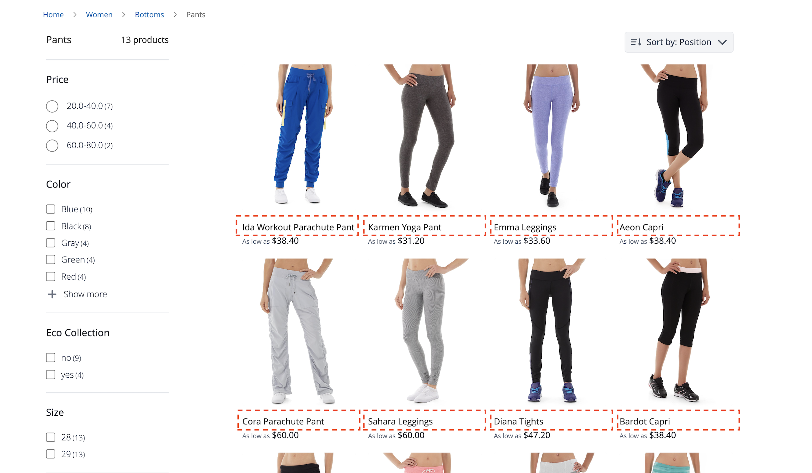
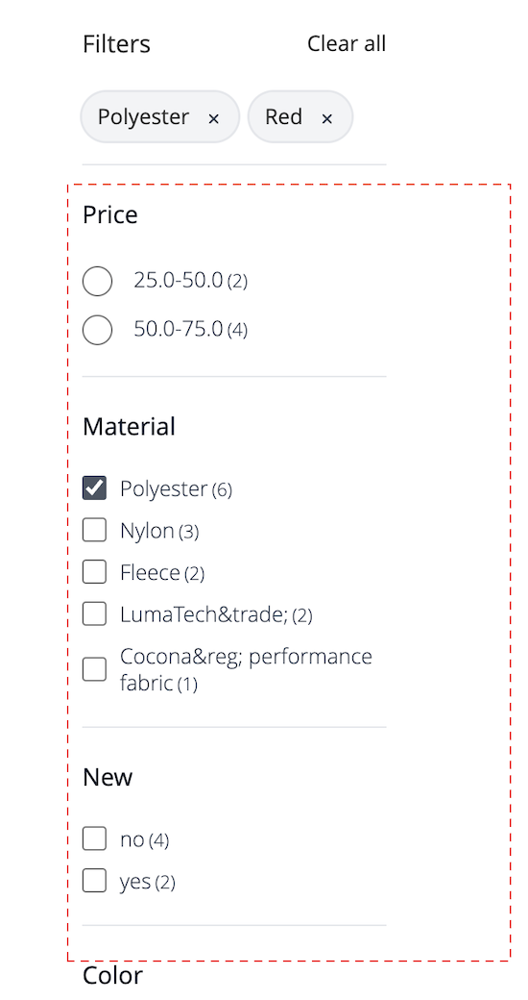

# 产品列表页面小组件

此 [!DNL Live Search Product Listing Page Widget] (PLP)使用Commerce Services平台提供高性能、可搜索且可彩块化的产品列表页面。 本主题介绍如何启用和设置PLP小组件的样式。

## 启用PLP小组件

当 [!DNL Live Search] 安装服务，默认搜索功能将转换为 [!DNL Live Search] 自动。

此 [!DNL Live Search] 默认情况下，新安装会启用PLP小组件。 如果您正在升级 [!DNL Live Search] 并且PLP小组件已关闭，将保持关闭状态。

>[!IMPORTANT]
>
>当 [!DNL Live Search Product Listing Page Widget] 启用，则无法更改产品列表页面上的排序顺序方向。

## 构件功能

PLP小组件提供以下开箱即用的功能：

- 添加到购物车按钮 — 仅适用于简单产品。
- 每个产品有多个图像 — 为可配置产品选择不同颜色时，图像可能会发生更改。
- 支持颜色样本 — 请注意，必须拼写颜色属性 `color` 以便代码正确验证。

### 自定义构件

除了PLP小组件的现成功能外，您还可以进一步自定义该小组件以包含以下功能：

- 按属性筛选
- 多语言支持
- 价格滑块

有关如何自定义PLP构件以处理上述功能的信息，请参阅 `storefront-product-listing-page` 自述文件如下 [repo](https://github.com/adobe/storefront-product-listing-page/).

>[!WARNING]
>
>如果使用存储库中提供的代码自定义PLP小组件，则需负责维护以及所需的任何更新。 Adobe版本的任何新PLP构件功能可能与您的自定义实施不兼容。

## 样式设置示例

您可以自定义PLP小组件的外观，以使用匹配您的网站 [CSS](https://developer.adobe.com/commerce/frontend-core/guide/css/).

>[!NOTE]
>
>不会继承Adobe Commerce主题中自定义类的元素。 这些元素必须由其特定类定位以匹配自定义类；主操作类不适用于构件按钮。 CSS中的常规目标元素会被继承； `button` 适用于构件按钮。

高亮显示的div包含目标类 `ds-sdk-product-item__product-name`.



通过添加规则使其变为大写来自定义产品名称。

```css
.ds-sdk-product-item__product-name {
 text-transform: uppercase;
}
```


## CSS类

### 产品列表

- `.ds-sdk-product-list`：外部div
- `.ds-sdk-product-list__grid`：内部div


#### 产品列表分页

- `.ds-plp-pagination`


- `.ds-plp-pagination_item`


- `.ds-plp-pagination_item--current`


### 小组件

- `.ds-widgets`：外部div
- `.ds-widgets__actions`：左侧内div
- `.ds-widgets__results`：右侧内div


### 排序下拉列表

- `.ds-sdk-sort-dropdown`


- `.ds-sdk-sort-dropdown__button`


- `.ds-sdk-sort-dropdown__items`


- `.ds-sdk-sort-dropdown__items--item`


- `.ds-sdk-sort-dropdown__items--item-selected`


- `.ds-sdk-sort-dropdown__items--item-active`


### Facet

- `.ds-plp-facets`
- `.ds-plp-facets__header`
- `.ds-plp-facets__header_title`
- `.ds-plp-facets__header__clear-all`

{width="350"}

- `.ds-plp-facets__pills`
- `.ds-sdk-pill`

{width="350"}

- `.ds-sdk-pill__label`
- `.ds-sdk-pill__cta`

{width="350"}

- `.ds-plp-facets__list`

{width="350"}

- `.ds-sdk-input`
- `.ds-sdk-input__label`
- `.ds-sdk-product-item__product-swatch-group`
- `ds-sdk-product-item__product-swatch-item`
- `.ds-sdk-input_fieldset_show-more`


- `.ds-sdk-labelled-input`


- `.ds-sdk-labelled-input__input`
- `.ds-sdk-labelled-input__label`


### 产品项目

- `.ds-sdk-product-item`
- `.ds-sdk-product-item__image`
- `.ds-sdk-product-item__product-name`
- `.ds-sdk-product-item__product-options`
- `.ds-sdk-product-price`
   - `.ds-sdk-product-price--no-discount`
   - `.ds-sdk-product-price--grouped`
   - `.ds-sdk-product-price--bundle`
   - `.ds-sdk-product-price--discount`


### 正在加载

- `.ds-sdk-loading`
- `.ds-sdk-loading__spinner`
- `.ds-sdk-loading__spinner-label`


## 禁用PLP构件

要禁用PLP小组件，请执行以下操作：

1. 转到 **商店** >设置> **配置** > **[!DNL Live Search]** > **店面特色** 并设置 **启用产品列表小组件** “不”。
1. 选择 **保存配置** 以保存设置。
