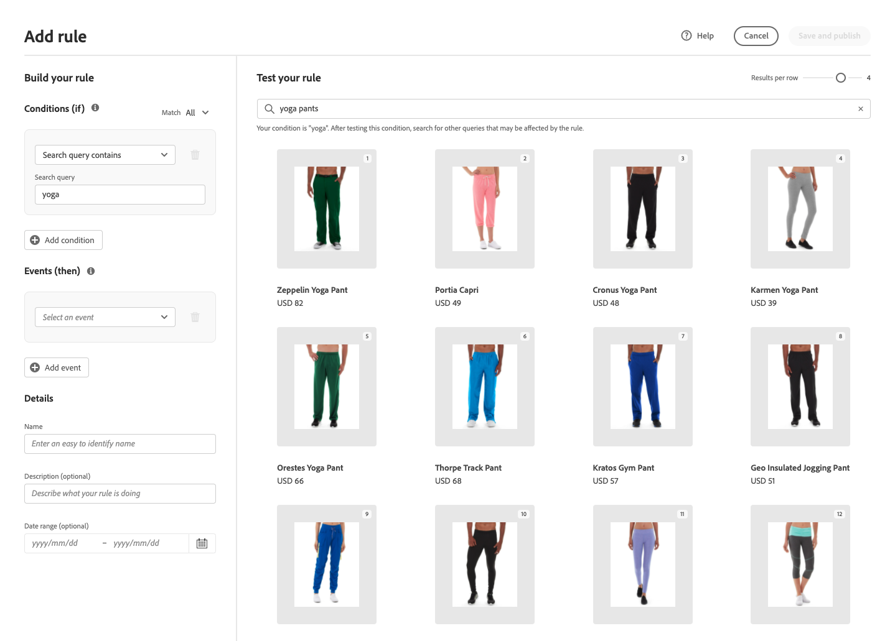

# 添加规则

要构建规则，第一步是使用规则编辑器在购物者的查询文本中定义触发关联事件的条件。 然后，完成规则详细信息、测试结果并发布规则。

## 步骤1:添加规则

1. 在管理员中，转到 **营销** > SEO和搜索> **实时搜索**.
1. 设置 **范围** 识别 [商店视图](https://experienceleague.adobe.com/docs/commerce-admin/start/setup/websites-stores-views.html#scope-settings) 当规则适用时。
1. 单击 **规则** 选项卡。
1. 单击 **添加规则** 以启动规则编辑器。

   

## 步骤2:描述条件

条件是触发事件的要求。 一个规则最多可包含10个条件和25个事件。

### 单个条件

1. 在 *构建规则*，选择 **条件** ，并按照说明完成陈述。

   * 搜索查询包含 — 输入购物者查询中必须包含的文本字符串。 匹配设置确定购物者查询与目录匹配的程度。 选项：  任意 — 购物者查询文本的任何部分都可以匹配条件。 全部 — 购物者的所有查询必须匹配条件。
   * 搜索查询是 — 输入与购物者查询完全匹配的文本字符串。 例如：“瑜伽裤”。 规则 `Search query is` 和匹配 `All` 只能有一个条件。
   * 搜索查询的开头 — 输入必须位于购物者查询开头的字符或文本字符串。
   * 搜索查询结束于 — 输入必须位于购物者查询末尾的字符或文本字符串。

   结果会立即显示在 *测试规则* 按优先级编号。 您可以使用 *每行结果数* 用于更改每行产品数量的右上角的滑块。

   

1. 要测试其他查询，请在 *测试规则* 搜索框和按 **返回**.
最初，测试窗格从“条件”搜索框中呈现查询。 但现在它正在从测试查询框中呈现查询。 测试窗格一次只渲染一个查询。

   

1. 如果您喜欢结果，请更新 *条件* 搜索框。 然后，单击页面上的任意位置，以更新测试窗格中的结果。
1. 要构建带有一个条件的简单规则，请转到步骤3: [添加事件](#events).

### 多个条件

1. 要构建包含多个条件的规则，请单击 **添加条件**.
一个规则最多可包含10个条件。 连接两个条件的逻辑运算符基于当前 *匹配* 设置。 默认情况下， *匹配* is `All` 逻辑运算符是 `AND`.

   

1. 选择第二个条件并输入所需的查询文本。

   

1. 要更改规则的逻辑，请更改 **匹配** 设置以确定购物者搜索标准必须与查询条件匹配的程度。 已设置 **匹配** 更改为以下内容之一：

   * 任意 — （默认）规则中的所有逻辑运算符都设置为 `OR` 结果将显示在测试窗格中。
   * 全部 — 规则中的所有逻辑运算符都设置为 `AND` 结果将显示在测试窗格中。

   的 *匹配* 值确定用于连接多个条件的逻辑运算符。 更改 *匹配* 设置会更改规则中的所有逻辑运算符。 无法合并 `AND` 和 `OR` 在同一规则中。

   在本例中，除了搜索“瑜伽裤”之外，还有两个单独的查询可搜索“yoga”或“pants”。 此规则不那么具体，在店面中触发的频率比在其他规则中触发的频率高。

   

1. 要添加其他条件，请单击 **添加条件** 然后重复这个过程。

## 步骤3:添加事件

事件是在满足条件时更改搜索结果的操作。 一个规则最多可包含25个事件。

1. 在 *事件*，选择 **事件** 在满足相关条件时进行。

   例如，选择 `Pin a product`. 然后，输入要固定的产品名称。 如果需要帮助，可以在测试窗格中找到该名称。
然后，输入 *位置* 显示固定产品的位置。 产品将移至测试窗格中的新位置，并标有 *已固定* 预览标记。

   

1. 对于多个事件，请选择您希望在满足条件时触发的任何其他事件。

   * 提升 — 选择提升。 然后，输入要在搜索结果中更靠前的产品名称或SKU。 在测试窗格中，每个提升的产品都具有 *已提升* 预览标记。
   * Bury — 在搜索结果中移动较低的SKU。 每个SKU都标有 *被埋* 测试窗格中的预览标记。
   * 固定产品 — 输入产品名称或SKU。 然后，选择应显示产品的搜索结果中的位置。 产品上标有 *已固定* 测试窗格中的预览标记。
   * 隐藏产品 — 从搜索结果中排除SKU。

## 步骤4:完成详细信息

此处输入的信息显示在 [规则详细信息](rules-workspace.md) 的上界。

1. 在 *详细信息*，输入 **名称** 规则。 所有规则名称必须唯一。
1. 输入摘要 **描述** 规则。
1. 输入 **开始日期** 和 **结束日期** 使规则处于活动状态，或从日历中选择日期。

   要选择日期范围，请单击第一个日期并拖动以选择该范围。

   

## 步骤5:测试规则

1. 在测试窗格中检查规则的结果。
1. 如果规则具有多个查询，则测试每个可能受规则影响的查询。

## 步骤6:保存和发布

1. 完成后，单击 **保存和发布**.

   规则将添加到规则工作区的列表中。

1. 尽管活动规则会立即生效，但您可能需要等待最多15分钟，才能刷新店面中缓存的查询结果。

## 字段描述

### 条件(if)

| 条件 | 描述 |
|--- |--- |
| 搜索查询包含 | 购物者查询中包含的文本字符或字符串。 购物者的查询只需匹配一个字符即可满足此条件。 |
| 搜索查询为 | 与购物者查询完全匹配的文本字符或字符串。 使用此条件时，无法组合具有多个条件的复杂查询。 |
| 搜索查询以开头 | 购物者的查询以此字符或文本字符串开头。 |
| 搜索查询结束于 | 购物者的查询以此字符或文本字符串结尾。 |

### 逻辑运算符

| 运算符 | 描述 |
|--- |--- |
| 或 | （默认）逻辑运算符 `OR` 比较两个条件，并满足在至少一个条件为true时触发事件的要求。 |
| 和 | 逻辑运算符 `AND` 比较两个条件，并满足在两个条件都为true时触发事件的要求。 |

### 匹配运算符

| 运算符 | 描述 |
|--- |--- |
| 任意 | 将规则中的所有逻辑运算符更改为 `OR` 和会返回一组匹配的产品。 |
| 全部 | 将规则中的所有逻辑运算符更改为 `AND` 和会返回一组匹配的产品。 |

### 事件

| Event | 描述 |
|--- |--- |
| 提升 | 在搜索结果中将SKU或SKU范围移得更高。 在测试搜索结果中，每个测试均带有“已提升”的预览徽章。 |
| 伯里 | 在搜索结果中将SKU或SKU范围移低。 在测试搜索结果中，每个测试均带有“隐藏”预览徽章。 |
| 固定产品 | 将单个SKU附加到搜索结果中的特定位置。 测试搜索结果中会使用“已固定”预览徽章标记产品。 |
| 隐藏产品 | 从搜索结果中排除SKU或SKU范围。 |

### 详细信息

| 字段 | 描述 |
|--- |--- |
| 名称 | 规则的名称。 规则名称必须唯一。 |
| 开始日期 | 规则的开始日期（如果已计划）。 |
| 结束日期 | 规则的结束日期（如果已计划）。 |
| 描述 | 规则的简要描述。 |
