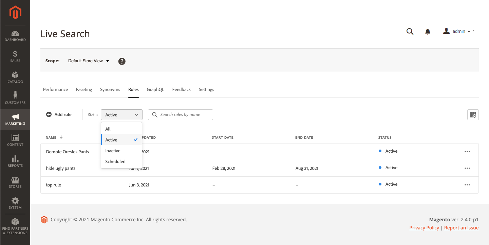

# 规则工作区

“规则”工作区列出了规则的当前选定内容及其状态，并提供了创建和管理规则所需工具的访问权限。 在工作区中，您可以：

* 搜索规则
* 查看规则详细信息
* 激活/停用规则
* 删除规则
* 访问规则编辑器

## 设置范围

如果Adobe Commerce安装包含多个商店视图，请设置 **范围** 到 [商店视图](https://docs.magento.com/user-guide/configuration/scope.html) 应用规则的位置。

## 显示/隐藏列

1. 在右上角，单击 **显示/隐藏**  列。
可见列在“选项”菜单中具有蓝色复选标记。 规则名称是唯一无法隐藏的列。

   

1. 在菜单中，执行以下任一操作：

   * 要显示隐藏列，请单击任意列名称，但不带复选标记。
   * 要隐藏可见列，请单击带复选标记的任何列名称。

   

## 按状态筛选规则

1. 如果您的商店有许多规则，则可以按状态过滤规则以缩短列表。 默认情况下，规则列表会显示所有规则。

   

1. 要仅列出具有特定状态设置的规则，请设置 **状态** 更改为以下内容之一：

   * 全部
   * 活动
   * 不活动
   * 已计划

   

## 按名称搜索规则

开始键入规则的名称或规则名称中的任何单词。
搜索会在您键入时查找匹配的规则。 匹配字符的字符串会在找到的每个规则的名称中突出显示。

## 查看详细信息

“详细信息”面板显示规则名称、状态、条件和事件、开始和结束日期、说明以及上次编辑的日期。 可以从“详细信息”面板中启用、编辑和删除规则。

1. 在 *规则* 选项卡，在网格中查找要查看的规则并单击 **更多** (...)。
1. 单击 **查看详细信息**.
您可以从“查看详细信息”面板中执行下列任一操作：

   * 编辑规则
   * 删除规则
   * 启用/禁用规则

1. 关闭 *查看详细信息* 面板，单击 **关闭** (X)。

   

## 列描述

| 列 | 描述 |
|--- |--- |
| 名称 | 规则的名称。 |
| 上次更新时间 | 上次更新规则的日期。 |
| 开始日期 | 计划规则的开始日期。 |
| 结束日期 | 计划规则的结束日期。 |
| 状态 | 颜色编码状态表示规则的当前状态。 使用网格上方的Status控件按状态筛选规则。 值： 全部状态 — 显示所有规则，而不考虑状态。 活动（蓝色） — 仅显示活动规则。 已计划（橙色） — 仅显示已计划的规则。 不活动（灰色） — 仅显示不活动的规则。 |

## 控件

| 控制 | 描述 |
|--- |--- |
| 添加规则 | 打开 [规则编辑器](rules-add.md). |
| 状态 | 按状态筛选规则列表。 选项：全部、活动、不活动、已计划 |
|  | 指定网格中可见的列。 选项：上次更新时间、开始日期、结束日期、状态 |
| 搜索 | 按全名或部分匹配搜索规则。 |
|  | 显示一个菜单，其中包含可应用于选定规则的更多操作。 选项：编辑，查看详细信息，删除 |

## 规则详细信息

| 字段 | 描述 |
|--- |--- |
| 状态 | 规则的当前状态。 |
| 条件 | 描述与规则关联的条件的搜索查询。 |
| 开始日期 | 规则生效的日期（如果已计划）。 |
| 结束日期 | 规则过期（如果已计划）的日期。 |
| 描述 | 规则的简要描述。 |
| 上次更新时间 | 上次更新规则的日期和时间。 |
| 已启用 | 用于更改规则状态的控件。 选项：已启用/已禁用 |
