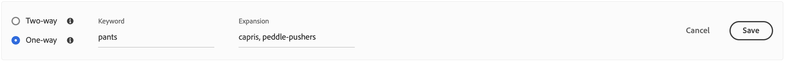

# 添加同义词

通过添加您自己策划的实时搜索同义词列表，提高客户参与度。 [!DNL Live Search] 每个同义词最多可管理200个同义词 `Data Space ID`.

![[!DNL Live Search] 同义词](assets/synonym-workspace.png)

## 步骤1:添加同义词

1. 在管理员中，转到 **营销** > SEO和搜索> **[!DNL Live Search]**.
1. 对于多个商店，请设置 **范围** 到 [商店视图](https://experienceleague.adobe.com/docs/commerce-admin/start/setup/websites-stores-views.html#scope-settings) 应用同义词设置时。
1. 单击 **同义词** 选项卡。
1. 单击 **添加同义词** 按钮。

## 步骤2:按类型定义同义词

按照 [同义词类型](synonyms-type.md) 创建。

### 双向同义词

1. 接受默认 **双向** 选项。

   

1. 输入 **关键词** 要匹配的术语或短语。
1. 输入 **扩展** 要添加为关键词同义词的术语。 用逗号分隔多个术语。
在此示例中，要匹配的关键词是“pants”，而扩展术语集是“长裤、裤子、斜纹”。

   

1. 完成后，单击 **保存**.
同义词集在列表中显示，每个术语之间有一个双向箭头，表示术语可互换。

   

### 单向同义词

1. 单击 **单向** 同义词类型。

   

1. 输入 **关键词** 和 **扩展** 术语。 用逗号分隔多个术语。

   

   在此示例中，关键词是“pants”，单向扩展词“capris， caff-length pants， peddle-pushers”都是“pants”的子集，但具有特定含义。

1. 完成后，单击 **保存**.
同义词集在列表中显示，并带有从扩展术语到关键词的单向箭头，以指示术语是关键词的子集。 每个扩展词之间用加号分隔。

   

## 步骤3:发布更改

1. 当同义词完成时，单击 **发布更改**.
1. 在店面等待长达2小时，以便更新内容可用。

## 字段描述

| 字段 | 描述 |
|--- |--- |
| [类型](synonyms.md) | 确定同义词的含义与关键词相同，还是关键词的子集。 选项： 双向（默认） — 与关键词具有相同含义并返回相同搜索结果的术语 单向 — 作为关键词子集的术语。 单向同义词会返回更窄的特定产品列表。 |
| 关键词 | 通常与目录中的一系列产品关联的词。 |
| 扩展 | 与关键词含义相同或相似的其他术语。 |
