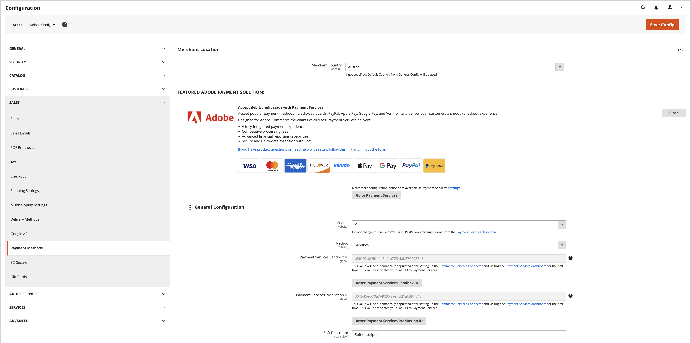

# 旧版 [!DNL Payment Services] 配置

您可以自定义 [!DNL Payment Services] 通过“管理员”中有用的配置选项满足您的需求。

配置时 [!DNL Payment Services] 对象 [!DNL Adobe Commerce] 和 [!DNL Magento Open Source] 在Admin中，这些配置仅适用于在中设置的环境。 _[!UICONTROL Method]_字段_[!UICONTROL General Configuration]_. 您在配置字段中所做的任何更改与切换 _[!UICONTROL Method]_选择 — 如果切换方法，则不会重置您的选择。

## 常规配置

您可以启用 [!DNL Payment Services] (适用于您的商店和  _[!UICONTROL Merchant Location]_，并在中启用沙盒测试或实时支付_[!UICONTROL General Configuration]_ 部分。

1. 在 _管理员_ 侧栏，转到 **[!UICONTROL Stores]** > _[!UICONTROL Settings]_>**[!UICONTROL Configuration]**.
1. 在左侧面板中，展开 **[!UICONTROL Sales]** 并选择 **[!UICONTROL Payment Methods]**.

   {width="400" zoomable="yes"}

1. 设置 _[!UICONTROL Merchant Country]_中的字段_[!UICONTROL Merchant Location]_.
1. 展开 _[!UICONTROL FEATURED ADOBE PAYMENT SOLUTION]_部分以访问_[!UICONTROL [!DNL Payment Services]]_ 部分。
1. 在 _[!UICONTROL [!DNL Payment Services]]_部分，展开_[!UICONTROL General Configuration]_ 部分。
1. 对象 **启用**，将其设置为 `Yes` 以启用 [!DNL Payment Services] 你商店的。
1. 对象 **方法**，将其设置为 `Sandbox` 如果您仍在测试 [!DNL Payment Services] 商店或 `Production` 如果您已准备好启用实时支付。

   >[!WARNING]
   >
   >您的 _[!UICONTROL Sandbox Merchant ID]_和_[!UICONTROL Production Merchant ID]_ 当您完成沙盒和/或生产的载入时，会自动生成并出现在他们的相应字段中。 请勿删除或更改这些ID。

1. 对象 **软描述符** （自定义值，显示在客户交易银行对帐单上，用于划分商店/品牌/目录），在文本字段中添加自定义文本（最多22个字符），替换 `Custom descriptor` 或现有值。
1. 单击 **[!UICONTROL Save Config]** 以保存更改。
1. 导航到 **[!UICONTROL System]** > **[!UICONTROL Cache Management]**，然后单击 **[!UICONTROL Flush Cache]** 以刷新所有无效缓存。

{width="700" zoomable="yes"}

### 配置选项

| 字段 | 范围 | 描述 |
|---|---|---|
| [!UICONTROL Enable] | 网站 | 启用或禁用 [!DNL Payment Services] 用于您的网站。 选项： `[!UICONTROL Yes]` / `[!UICONTROL No]` |
| [!UICONTROL Method] | 商店视图 | 为存储设置方法或环境。 选项： [!UICONTROL Sandbox] / [!UICONTROL Production] |
| [!UICONTROL Sandbox Merchant ID] | 商店视图 | 您的沙盒商家ID，在沙盒载入期间自动生成。 请勿更改或更改此ID。 |
| [!UICONTROL Production Merchant ID] | 商店视图 | 您的生产商家ID，在沙盒载入期间自动生成。 请勿更改或更改此ID。 |
| [!UICONTROL Soft Descriptor] | 网站或商店视图 | 向您的网站和商店视图添加软描述符，以将信息添加到描述品牌、商店或产品线的客户交易。 |

## [!UICONTROL Credit Card Fields]

此 [!UICONTROL Credit Card Fields] 支付选项为信用卡或借记卡支付方法提供简单且安全的结账。

请参阅 [支付选项](payments-options.md#paypal-smart-buttons) 以了解更多信息。

1. 在 _管理员_ 侧栏，转到 **[!UICONTROL Stores]** > _[!UICONTROL Settings]_>**[!UICONTROL Configuration]**.
1. 在左侧面板中，展开 **[!UICONTROL Sales]** 并选择 **[!UICONTROL Payment Methods]**.
1. 展开 _[!UICONTROL FEATURED ADOBE PAYMENT SOLUTION]_部分。
1. 在 _[!UICONTROL Payment Services]_部分，展开_[!UICONTROL Credit Card Fields]_ 部分。
1. 对象 **[!UICONTROL Title]**，输入文本（如果需要）以更改结账期间显示的付款方式名称。
1. 至 [设置付款操作](production.md#set-payment-services-as-payment-method)，选择 **[!UICONTROL Authorize]** 或 **授权和捕获**.
1. 要在结账页面上排定付款方法的优先级，请提供 `Numeric Only` 中的值 **[!UICONTROL Sort order]** 字段。
1. 对象 **[!UICONTROL Show on checkout page]**，选择 `Yes` 以启用结账页面上的信用卡字段。
1. 对象 **[!UICONTROL Vault Enabled]**，选择 `Yes` 启用信用卡保险库以进行结账。
1. 对象 **[!UICONTROL Vault Enabled in Admin]**，选择 `Yes` 使商家能够使用其保险存储的信用卡为客户创建订单。
1. 要启用 **[!UICONTROL 3DS Secure authentication]** (`Off` 默认情况下)选择 `Always` 或 `When required`.
1. 对象 **[!UICONTROL Debug Mode]**，选择 `Yes` 启用调试模式，或 `No` 来禁用它。
1. 单击 **[!UICONTROL Save Config]** 以保存更改。
1. 导航到 **[!UICONTROL System]** > **[!UICONTROL Cache Management]**，然后单击 **[!UICONTROL Flush Cache]** 以刷新所有无效缓存。

### 配置选项

| 字段 | 范围 | 描述 |
|---|---|---|
| [!UICONTROL Title] | 商店视图 | 在结帐期间，添加要作为此付款选项的标题显示在“付款方式”视图中的文本。 选项： [!UICONTROL text field] |
| [!UICONTROL Payment Action] | 网站 | 此 [付款操作](https://experienceleague.adobe.com/docs/commerce-admin/config/sales/payment-methods/payment-methods.html) 指定付款方式的。 选项： [!UICONTROL Authorize] / [!UICONTROL Authorize and Capture] |
| [!UICONTROL Sort order] | 商店视图 | 结账页面上指定支付方式的排序顺序。 `Numeric Only` 值 |
| [!UICONTROL Show on checkout page] | 网站 | 启用或禁用结账页面上的信用卡字段。 选项： [!UICONTROL Yes] / [!UICONTROL No] |
| [!UICONTROL Vault enabled] | 商店视图 | 启用或禁用 [信用卡保险存储](vaulting.md). 选项： [!UICONTROL Yes] / [!UICONTROL No] |
| [!UICONTROL Vault enabled in Admin] | 商店视图 | 启用或禁用以下功能 [要在管理员中为客户完成订单的商家](vaulting.md) 使用保管式支付方式。 选项： [!UICONTROL Yes] / [!UICONTROL No] |
| [!UICONTROL 3DS Secure authentication] | 网站 | 启用或禁用 [3DS安全身份验证](security.md#3ds). 选项： [!UICONTROL Always] / [!UICONTROL When Required] / [!UICONTROL Off] |
| [!UICONTROL Debug Mode] | 网站 | 启用或禁用调试模式。 选项： `[!UICONTROL Yes]` / `[!UICONTROL No]` |

## [!UICONTROL Apple Pay]

此 [!UICONTROL Apple Pay] 付款选项允许商家向其购物者提供Apple Pay，购物者可以在自己的设备上使用Touch ID从Safari浏览器中进行购买。 商户在每个商户帐户中最多可以添加99个域。

请参阅 [支付选项](payments-options.md#apple-pay-button) 以了解更多信息。

1. 在 _管理员_ 侧栏，转到 **[!UICONTROL Stores]** > _[!UICONTROL Settings]_>**[!UICONTROL Configuration]**.
1. 在左侧面板中，展开 **[!UICONTROL Sales]** 并选择 **[!UICONTROL Payment Methods]**.
1. 展开 _[!UICONTROL FEATURED ADOBE PAYMENT SOLUTION]_部分。
1. 在 _[!UICONTROL Payment Services]_部分，展开_[!UICONTROL Apple Pay]_ 部分。
1. 对象 **[!UICONTROL Title]**，输入文本（如果需要）以更改结账期间显示的付款方式名称。
1. 至 [设置付款操作](production.md#set-payment-services-as-payment-method)，选择 **[!UICONTROL Authorize]** 或 **[!UICONTROL Authorize and Capture]**.
1. 指定 [!DNL Apple Pay] 选项通过在Adobe Commerce中选择 `Yes` （在下列选项中）：
   * **[!UICONTROL Show Apple Pay on checkout page]**
   * **[!UICONTROL Show Apple Pay on product detail page]**
   * **[!UICONTROL Show Apple Pay in mini cart preview]**
   * **[!UICONTROL Show Apple Pay on cart page]**
1. 要启用调试模式，请选择 `Yes` 对于 **[!UICONTROL Debug Mode]** (`No` 禁用它)。
1. 要保存更改，请单击 **[!UICONTROL Save Config]** .
1. 导航到 **[!UICONTROL System]** > **[!UICONTROL Cache Management]**，然后单击 **[!UICONTROL Flush Cache]** 以刷新所有无效缓存。

### 配置选项

| 字段 | 范围 | 描述 |
|---|---|---|
| [!UICONTROL Title] | 商店视图 | 在结帐期间，添加要作为此付款选项的标题显示在“付款方式”视图中的文本。 选项： [!UICONTROL text field] |
| [!UICONTROL Payment Action] | 网站 | 此 [付款操作](https://experienceleague.adobe.com/docs/commerce-admin/config/sales/payment-methods/payment-methods.html) 指定付款方式的。 选项： [!UICONTROL Authorize] / [!UICONTROL Authorize and Capture] |
| [!UICONTROL Show on checkout page] | 网站 | 启用或禁用 [!DNL Apple Pay] 在结帐页面上。 选项： `[!UICONTROL Yes]` / `[!UICONTROL No]` |
| [!UICONTROL Sort order] | 商店视图 | 结账页面上指定付款方式的排序顺序。 `Numeric Only` 值 |
| [!UICONTROL Show buttons on product detail page] | 商店视图 | 启用或禁用 [!DNL Apple Pay] 在产品详细信息页面上。 选项： `[!UICONTROL Yes]` / `[!UICONTROL No]` |
| [!UICONTROL Show buttons in mini-cart preview] | 商店视图 | 启用或禁用 [!DNL Apple Pay] 在迷你购物车预览中。 选项： `[!UICONTROL Yes]` / `[!UICONTROL No]` |
| [!UICONTROL Show buttons on cart page] | 商店视图 | 启用或禁用 [!DNL Apple Pay] 在购物车页面上。 选项： `[!UICONTROL Yes]` / `[!UICONTROL No]` |
| [!UICONTROL Debug Mode] | 网站 | 启用或禁用调试模式。 选项： `[!UICONTROL Yes]` / `[!UICONTROL No]` |

## [!UICONTROL Google Pay]

此 [!UICONTROL Google Pay] 付款选项允许商家向其购物者提供使用Google Wallet进行购买的Google Pay。

请参阅 [支付选项](payments-options.md#google-pay-button) 以了解更多信息。

1. 在 _管理员_ 侧栏，转到 **[!UICONTROL Stores]** > _[!UICONTROL Settings]_>**[!UICONTROL Configuration]**.
1. 在左侧面板中，展开 **[!UICONTROL Sales]** 并选择 **[!UICONTROL Payment Methods]**.
1. 展开 _[!UICONTROL FEATURED ADOBE PAYMENT SOLUTION]_部分。
1. 在 _[!UICONTROL Payment Services]_部分，展开_[!UICONTROL Google Pay]_ 部分。
1. （可选）通过在以下位置输入新名称来更改结账期间显示的付款方法的名称： **[!UICONTROL Title]** 字段。
1. [设置付款操作](production.md#set-payment-services-as-payment-method) 通过选择 **[!UICONTROL Authorize]** 或 **[!UICONTROL Authorize and Capture]**.
1. 指定 [!DNL Google Pay] 选项通过在Adobe Commerce中选择 `Yes` （在下列选项中）：
   * **[!UICONTROL Show Google Pay on checkout page]**
   * **[!UICONTROL Show Google Pay on product detail page]**
   * **[!UICONTROL Show Google Pay in mini cart preview]**
   * **[!UICONTROL Show Google Pay on cart page]**
1. 要启用调试模式，请选择 `Yes` 对于 **[!UICONTROL Debug Mode]** (`No` 禁用它)。
1. 配置的外观 _[!UICONTROL Google Pay]_按钮以选择&#x200B;**[!UICONTROL Button Color]**，**[!UICONTROL Button Type]**、和&#x200B;**[!UICONTROL Button Style]**根据需要。
1. 要设置高度，使用中定义的默认高度值 **[!UICONTROL Button Style]**.
1. 要保存更改，请单击 **[!UICONTROL Save Config]** .
1. 导航到 **[!UICONTROL System]** > **[!UICONTROL Cache Management]**，然后单击 **[!UICONTROL Flush Cache]** 以刷新所有无效缓存。

### 配置选项

| 字段 | 范围 | 描述 |
|---|---|---|
| [!UICONTROL Title] | 商店视图 | 指定在结帐期间在“付款方式”视图中为此付款选项显示的文本标签。 选项： `[!UICONTROL text field]` |
| [!UICONTROL Payment Action] | 网站 | 此 [付款操作](https://experienceleague.adobe.com/docs/commerce-admin/config/sales/payment-methods/payment-methods.html) 指定付款方式的。 选项： `[!UICONTROL Authorize]` / `[!UICONTROL Authorize and Capture]` |
| [!UICONTROL Show on checkout page] | 网站 | 启用或禁用 [!DNL Google Pay] 在结帐页面上。 选项： `[!UICONTROL Yes]` / `[!UICONTROL No]` |
| [!UICONTROL Sort order] | 商店视图 | 结账页面上指定付款方式的排序顺序。 `Numeric Only` 值 |
| [!UICONTROL Show buttons on product detail page] | 商店视图 | 启用或禁用 [!DNL Google Pay] 在产品详细信息页面上。 选项： `[!UICONTROL Yes]` / `[!UICONTROL No]` |
| [!UICONTROL Show buttons in mini-cart preview] | 商店视图 | 启用或禁用 [!DNL Google Pay] 在迷你购物车预览中。 选项： `[!UICONTROL Yes]` / `[!UICONTROL No]` |
| [!UICONTROL Show buttons on cart page] | 商店视图 | 启用或禁用 [!DNL Google Pay] 在购物车页面上。 选项： `[!UICONTROL Yes]` / `[!UICONTROL No]` |
| [!UICONTROL Debug Mode] | 网站 | 启用或禁用调试模式。 选项： `[!UICONTROL Yes]` / `[!UICONTROL No]` |
| [!UICONTROL Button Color] | 商店视图 | 定义颜色 [!DNL Google Pay] 按钮。 选项： `[!UICONTROL Default]` / `[!UICONTROL Black]` / `[!UICONTROL White]` |
| [!UICONTROL Button Type] | 商店视图 | 定义 [!DNL Google Pay] 按钮。 选项： `[!UICONTROL buy]` / `[!UICONTROL checkout]` / `[!UICONTROL order]` / `[!UICONTROL pay]` / `[!UICONTROL plain]` |

请参阅 [Google Pay API请求对象选项](https://developers.google.com/pay/api/web/reference/request-objects) 文档，以了解更多信息。

## [!DNL PayPal Payment Buttons]

此 [!DNL PayPal payment buttons] 支付选项为您的客户提供简单、快速和安全的结账过程。

请参阅 [支付选项](payments-options.md#paypal-smart-buttons) 以了解更多信息。

配置 [!DNL PayPal payment buttons]

您可以在管理员中启用和配置PayPal付款按钮付款选项：

1. 在 _管理员_ 侧栏，转到 **[!UICONTROL Stores]** > _[!UICONTROL Settings]_>**[!UICONTROL Configuration]**.
1. 在左侧面板中，展开 **[!UICONTROL Sales]** 并选择 **[!UICONTROL Payment Methods]**.
1. 展开 _[!UICONTROL FEATURED ADOBE PAYMENT SOLUTION]_部分。
1. 在 _[!UICONTROL Payment Services]_部分，展开_[!UICONTROL PayPal payment buttons]_ 部分。
1. 要更改结账期间显示的付款方式名称，请编辑 _[!UICONTROL Title]_字段。
1. 至 [设置付款操作](production.md#set-payment-services-as-payment-method)，选择 **[!UICONTROL Authorize]** 或 **[!UICONTROL Authorize and Capture]**.
1. 要在结账页面上排定付款方法的优先级，请提供 `Numeric Only` 中的值 **[!UICONTROL Sort order]** 字段。
1. 要启用/禁用 [“稍后支付”消息](payments-options.md#pay-later-button)，选择 `Yes`/`No` 对象 **[!UICONTROL Display Pay Later Message]**.
1. 通过选择，指定在Adobe Commerce中启用PayPal支付按钮的位置 `Yes` （在下列选项中）：
   * **[!UICONTROL Show buttons on checkout page]**
   * **[!UICONTROL Show buttons on product detail page]**
   * **[!UICONTROL Show buttons in mini cart preview]**
   * **[!UICONTROL Show buttons on cart page]**
1. 要启用Venmo作为付款选项，请选择 `Yes` 对象 **[!UICONTROL Venmo Enabled]**.
1. 要启用信用卡和借记卡作为付款选项（PayPal智能按钮），请选择 `Yes` 对象 **[!UICONTROL Credit and Debit Card Enabled]**.
1. 要启用/禁用 [PayPal稍后支付](payments-options.md#pay-later-button) 付款选项，选择 `Yes`/`No` 对象 **[!UICONTROL PayPal Pay Later Enabled]**.
1. 要启用调试模式，请选择 `Yes` 对于 **[!UICONTROL Debug Mode]** (`No` 禁用它)。
1. 要保存更改，请单击 **[!UICONTROL Save Config]** .
1. 导航到 **[!UICONTROL System]** > **[!UICONTROL Cache Management]**，然后单击 **[!UICONTROL Flush Cache]** 以刷新所有无效缓存。

### 配置选项

| 字段 | 范围 | 描述 |
|---|---|---|
| [!UICONTROL Title] | 商店视图 | 在结帐期间，在“付款方式”视图中添加要作为此付款选项的标题显示的文本。 选项：文本字段 |
| [!UICONTROL Payment Action] | 网站 | 此 [付款操作](https://docs.magento.com/user-guide/configuration/sales/payment-methods.html#payment-actions){target="_blank"} 指定付款方式的。 选项： [!UICONTROL Authorize] / [!UICONTROL Authorize and Capture] |
| [!UICONTROL Display Pay Later Message] | 网站 | 在购物车、产品页面、迷你购物车和结帐流程中启用或禁用“稍后付款”消息。 选项： `[!UICONTROL Yes]` / `[!UICONTROL No]` |
| [!UICONTROL Show buttons on checkout page] | 商店视图 | 启用或禁用 [!DNL PayPal payment buttons] 在结帐页面上。 选项： `[!UICONTROL Yes]` / `[!UICONTROL No]` |
| [!UICONTROL Show buttons on product detail page] | 商店视图 | 启用或禁用 [!DNL PayPal payment buttons] 在产品详细信息页面上。 选项： `[!UICONTROL Yes]` / `[!UICONTROL No]` |
| [!UICONTROL Show buttons in mini-cart preview] | 商店视图 | 启用或禁用 [!DNL PayPal payment buttons] 在迷你购物车预览中。 选项： `[!UICONTROL Yes]` / `[!UICONTROL No]` |
| [!UICONTROL Show buttons on cart page] | 商店视图 | 启用或禁用 [!DNL PayPal payment buttons] 在购物车页面上。 选项： `[!UICONTROL Yes]` / `[!UICONTROL No]` |
| [!UICONTROL Venmo Enabled] | 商店视图 | 启用或禁用显示付款按钮的Venmo付款选项。 选项： `[!UICONTROL Yes]` / `[!UICONTROL No]` |
| [!UICONTROL Credit and Debit Card Enabled] | 商店视图 | 启用或禁用显示付款按钮的信用卡和借记卡选项。 选项： `[!UICONTROL Yes]` / `[!UICONTROL No]` |
| [!UICONTROL PayPal Pay Later Enabled] | 商店视图 | 启用或禁用显示付款按钮的PayPal Pay Later付款选项外观。 选项： `[!UICONTROL Yes]` / `[!UICONTROL No]` |
| [!UICONTROL Debug Mode] | 网站 | 启用或禁用调试模式。 选项： `[!UICONTROL Yes]` / `[!UICONTROL No]` |

## 按钮样式

您还可以配置 _[!UICONTROL Button style]_付款按钮的选项：

1. 在 _管理员_ 侧栏，转到 **[!UICONTROL Stores]** > _[!UICONTROL Settings]_>**[!UICONTROL Configuration]**.
1. 在左侧面板中，展开 **[!UICONTROL Sales]** 并选择 **[!UICONTROL Payment Methods]**.
1. 展开 _[!UICONTROL FEATURED ADOBE PAYMENT SOLUTION]_部分。
1. 在 _[!UICONTROL [!DNL Payment Services]]_部分，展开_[!UICONTROL PayPal Smart Button Styling]_ 部分。
1. 要设置布局，请选择 `Vertical` 或 `Horizontal` 对象 **[!UICONTROL Layout]**
1. 要设置颜色，请从中的可用颜色中选择 **[!UICONTROL Color]**.
1. 要设置形状，请选择 `Rectangular` 或 `Pill` 对象 **[!UICONTROL Shape]**.
1. 要使用默认高度，请选择 `Yes` 或 `No` 对象 **[!UICONTROL Use Default Height]**.
1. 要设置自定义高度，请为添加所需的像素高度 **[!UICONTROL Height]**.
1. 要设置标语，请选择 `Yes` 或 `No` 对象 **[!UICONTROL Tagline]**.
1. 要保存更改，请单击 **[!UICONTROL Save Config]** .
1. 导航到 **[!UICONTROL System]** > **[!UICONTROL Cache Management]**，然后单击 **[!UICONTROL Flush Cache]** 以刷新所有无效缓存。

您还可以配置付款按钮样式 [在设置中](settings.md#button-style) 从支付服务主页。

### 配置选项

| 字段 | 范围 | 描述 |
|--- |--- |--- |
| [!UICONTROL Layout] | 商店视图 | 定义Paypal付款按钮的布局样式。 选项： `[!UICONTROL Vertical]` / `[!UICONTROL Horizontal]` |
| [!UICONTROL Color] | 商店视图 | 定义Paypal付款按钮的颜色。 选项： [!UICONTROL Blue] / `[!UICONTROL Gold]` / `[!UICONTROL Silver]` / `[!UICONTROL White]` / `[!UICONTROL Black]` |
| [!UICONTROL Shape] | 商店视图 | 定义Paypal付款按钮的形状。 选项： `[!UICONTROL Rectangular]` / `[!UICONTROL Pill]` |
| [!UICONTROL Use Default Height] | 商店视图 | 定义PayPal付款按钮是否使用默认高度。 选项： `[!UICONTROL Yes]` / `[!UICONTROL No]` |
| [!UICONTROL Height] | 商店视图 | 定义PayPal付款按钮的高度。 默认值：无 |
| [!UICONTROL Label] | 商店视图 | 定义显示在PayPal付款按钮中的标签。 选项： `[!UICONTROL PayPal]` / `[!UICONTROL Checkout]` / `[!UICONTROL Buynow]` / `[!UICONTROL Pay]` / `[!UICONTROL Installment]` |
| [!UICONTROL Tagline] | 商店视图 | 启用标语。 选项： `[!UICONTROL Yes]` / `[!UICONTROL No]` |

## 刷新缓存

如果更改配置， [手动刷新缓存](/help/payment-services/settings.md#flush-the-cache) 以便您的商店显示最新的配置设置。
