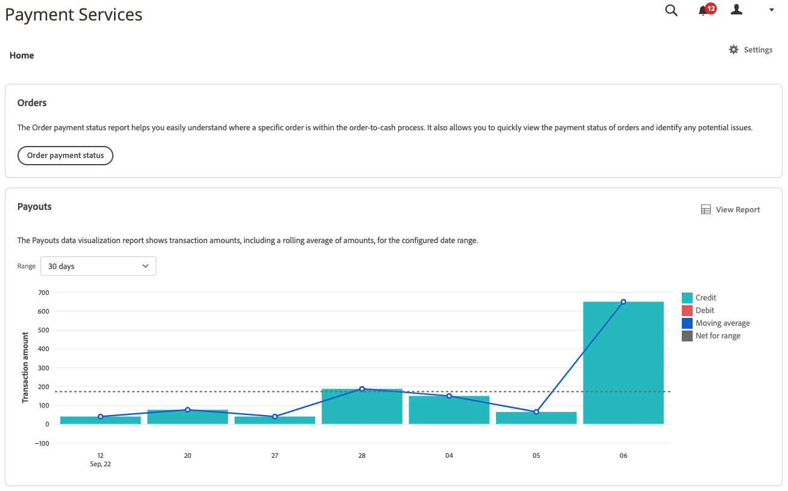

# 订单付款状态报表

[!DNL Payment Services] 对象 [!DNL Adobe Commerce] 和 [!DNL Magento Open Source] 提供全面的报告，以便您清楚地了解商店的订单和付款。

订单付款状态报表可帮助您轻松了解特定订单在订单到现金处理流程中的位置。 通过此报表，您可以快速查看订单的付款状态并确定任何潜在问题。

您不必打开多个视图，即可人工交叉参考订单和付款。 [!DNL Payment Services] 对象 [!DNL Adobe Commerce] 和 [!DNL Magento Open Source] 使您能够全面了解订单和付款 — 所有这些都在订单付款状态报表中。

在“管理员”中查看此报表中的付款状态、已开票和已发运状态、退款状态、争议状态等。

您可以下载.csv文件格式的“订单”付款状态交易记录，以便在现有的会计软件或订单管理软件中使用。

>[!NOTE]
>
>如果没有，则无法查看财务报表 [已载入和激活的实时模式](production.md#enable-live-payments) 对象 [!DNL Payment Services].

## 报告中使用的数据

此 [!DNL Payment Services] 模块使用订单数据，并将其与其他来源（包括PayPal）的汇总付款数据相结合，以提供有意义且非常有用的报表。

订单数据将导出并保留在支付服务中。 当您 [更改或添加订单状态](https://docs.magento.com/user-guide/sales/order-status-custom.html){target="_blank"} or [edit a store view](https://docs.magento.com/user-guide/stores/stores-all-view-edit.html){target="_blank"}, [store](https://docs.magento.com/user-guide/stores/store-information.html){target="_blank"}或网站名称)时，该数据与付款数据相结合，并且使用结合的信息填充“订单付款状态”报表。

此流程包含两个步骤：

1. 索引已更改数据 `ON SAVE` （每次更改订单信息或商店信息时）或 `BY SCHEDULE` （按照预配置的cron计划），具体取决于在中如何进行配置 [索引管理](https://docs.magento.com/user-guide/system/index-management.html){target="_blank"} 在Admin中。

   默认情况下，进行数据索引 `ON SAVE`，这意味着每当订单中的某些内容、订单状态、商店视图、商店或网站发生更改时，索引过程都会立即发生。

1. 将索引数据发送到付款服务，然后填充到订单付款状态报表中。

为报告目的而导出和整理的唯一数据是订单付款状态报表使用的数据。

>[!NOTE]
>
>此表中显示的数据按降序排序(`DESC`)默认情况下，使用 `ORDER DATE`. 此 `ORDER DATE` 是创建订单的日期时间戳。

### 配置数据导出

即使默认情况下，重新索引发生在 `ON SAVE` 模式，建议您在以下位置索引： `BY SCHEDULE` 模式。 此 `BY SCHEDULE` 索引按cron计划运行，运行时间为1分钟，任何更改的数据将在任何数据更改后的2分钟内显示在订单状态报表中。 此计划的重新索引可帮助您减轻存储的任何压力，尤其是在您有大量传入订单的情况下，因为它按计划进行（而不是在每次下订单时）。

可以更改索引模式 — `ON SAVE` 或 `BY SCHEDULE`—[在管理员中](https://docs.magento.com/user-guide/system/index-management.html#change-the-index-mode){target="_blank"}.

要了解如何配置数据导出，请参阅 [命令行配置](configure-cli.md#configure-data-export).

## 可用性

在 _管理员_ 侧栏，转到 **[!UICONTROL Sales]** > **[!UICONTROL Payment Services]** > **[!UICONTROL Order payment status]** 以查看订单的付款状态。

## 选择数据源

在“订单付款状态”报表视图中，您可以选择数据源 — _[!UICONTROL Live]_或_[!UICONTROL Sandbox]_ — 您希望查看其报告结果。

如果 _[!UICONTROL Live]_是选定的数据源，则可以查看使用的商店的报表信息 [!DNL Payment Services] 在_[!UICONTROL Live]_ 模式。 如果 [!UICONTROL Sandbox]_是选定的数据源，您可以看到沙盒环境的报表信息。

数据源选择的工作方式如下：

* 如果您没有任何使用 [!DNL Payment Services] 在实时模式下，数据源选择默认为 _[!UICONTROL Sandbox]_.
* 如果您有任何商店（一个或多个）使用 [!DNL Payment Services] 在实时模式下，数据源选择默认为 _[!UICONTROL Live]_.
* 报表导出始终遵循数据源选择。

要为选择数据源，请执行以下操作 [!UICONTROL Order Payment Status] 报告：

1. 在 _管理员_ 侧栏，转到 **[!UICONTROL Sales]** > **[!UICONTROL [!DNL Payment Services]]** > **[!UICONTROL Order payment status]**.
1. 单击 **[!UICONTROL Data source]** 并选择 _[!UICONTROL Live]_或_[!UICONTROL Sandbox]_.

   报表结果会根据所选数据源重新生成。

## 自定义日期时间范围

从“订单付款状态”报表视图中，您可以通过选择特定日期，自定义要查看的状态的时间范围。 默认情况下，网格中显示30天的订单付款状态。

1. 在 _管理员_ 侧栏，转到 **[!UICONTROL Sales]** > **[!UICONTROL [!DNL Payment Services]]** > **[!UICONTROL Order payment status]**.
1. 单击 **[!UICONTROL Order dates]** 日历选择器过滤器。
1. 选择适用的日期范围。
1. 查看网格中指定日期的订单付款状态。

## 显示和隐藏列

默认情况下，“订单付款状态”报表会显示所有可用的信息列。 但是，您可以自定义您在报表中看到的列。

1. 在 _管理员_ 侧栏，转到 **[!UICONTROL Sales]** > **[!UICONTROL [!DNL Payment Services]]** > **[!UICONTROL Order payment status]**.
1. 单击 _列设置_ 图标()。
1. 要自定义您在报表中看到的列，请选中或取消选中列表中的列。

   订单付款状态报表将立即显示您在“列设置”菜单中所做的任何更改。 列首选项将进行保存，如果您离开报表视图，这些首选项将保持有效。

## 查看状态

“订单付款状态”报表视图显示每个付款服务订单的综合事务处理状态和支付状态信息。

### 交易状态

默认情况下，网格中显示30天的订单付款状态。

向左和向右滚动以查看 [订单付款状态信息](#column-descriptions)，包括订单日期、授权日期、开票、已发运、付款状态等。

搜索中返回的行数，或显示在默认的30天订单付款状态的行数，显示在订单付款状态视图网格的上方，以及订单日期日历选择器过滤器。

### 付薪状态

“支付状态”列显示任何付款的当前状态。 A `Capture failed` 付款显示红色警报状态和 `Voided` 付款显示灰色警报状态。

### 退款状态

退款状态列显示任何退款的当前状态。 A `Capture failed` 付款显示红色警报状态和 `Voided` 付款显示灰色警报状态。

## 更新报表数据

订单付款状态报表视图显示 _[!UICONTROL Last updated]_显示上次更新报告信息的时间戳。 默认情况下，订单付款状态报表数据每三小时自动刷新一次。

您还可以人工强制刷新订单付款状态报表数据，以查看最新的报表信息。

1. 在 _管理员_ 侧栏，转到 **[!UICONTROL Sales]** > **[!UICONTROL [!DNL Payment Services]]** > **[!UICONTROL Order payment status]**.
1. 单击 _刷新_ 图标()。

   订单付款状态报表数据已刷新，并且 *[!UICONTROL Update complete]* 确认后，网格中将显示最新信息。

## 查看争议

您可以在订单付款状态报表中查看商店订单上的任何争议，然后定位至PayPal解决中心对其执行活动。

1. 在 _管理员_ 侧栏，转到 **[!UICONTROL Sales]** > **[!UICONTROL [!DNL Payment Services]]** > **[!UICONTROL Order payment status]**.
1. 导航到 **[!UICONTROL Disputes column]**.
1. 查看特定订单的任何争议并查看 [争议状态](#order-payment-status-information).
1. 单击争议ID链接(从 _PP-D-_)以转到 [PayPal解决中心](https://www.paypal.com/us/smarthelp/article/what-is-the-resolution-center-faq3327).
1. 根据需要采取适当行动处理争议。

   要按状态对订单争议进行排序，请单击“争议”列标题。

## 下载订单付款状态

无论您查看的是默认的30天状态还是自定义的时间范围，都可以下载在“订单付款”状态视图网格中可见所有状态的.csv文件。

1. 在 _管理员_ 侧栏，转到 **[!UICONTROL Sales]** > **[!UICONTROL [!DNL Payment Services]]** > **[!UICONTROL Order payment status]**.
1. 如果您希望查看过去30天以外的时间范围的状态， [自定义状态的日期范围时间范围](#customize-dates-timeframe).
1. 单击 _下载_ ()图标。

您的订单付款状态将以.csv格式下载。

<!-- ## Default order payment status timeframes

These order payment status timeframes are currently available in [!DNL Payment Services].

| Report       | Description          |
| ------------ | -------------------- |
| Yesterday | Available from the Order payment status dates selector, this shows information for the prior date. |
| | Today | Available from the Order payment status dates selector, this shows information for the current day. |
| Last 7 days | Available from the Order payment status dates selector, this shows information for the last seven days. |
| Last 30 days | Available from the Order payment status dates selector and by default in the Order payment statuses view, this shows information for the last 30 days. |
| Last 90 days | Available from the Order payment status dates selector, this shows information for the last 90 days. |
| Year to date | Available from the Order payment status dates selector, this shows information for the the entire year to date. |
| Custom range | Available from the Order payment status dates selector, this can be filtered to show a custom date range. |
-->

## 订单付款状态信息

“订单付款状态”视图显示网格中显示的每个状态的详细信息。

### 列描述

订单付款状态报表包括以下信息。

| 列 | 描述 |
| ------------ | -------------------- |
| [!UICONTROL Order ID] | 商业订单ID   查看相关内容 [订单信息](https://docs.magento.com/user-guide/sales/orders.html){target="_blank"}中，单击ID。 |
| [!UICONTROL Order Date] | 订单日期时间戳 |
| [!UICONTROL Authorized Date] | 付款授权的日期时间戳 |
| [!UICONTROL Order Status] | 当前商务 [订单状态](https://docs.magento.com/user-guide/sales/order-status.html){target="_blank"} |
| [!UICONTROL Invoiced] | 订单的发票状态 — *[!UICONTROL No]*， *[!UICONTROL Partial]*，或 *[!UICONTROL Yes]* |
| [!UICONTROL Shipped] | 订单的装运状态 — *[!UICONTROL No]*， *[!UICONTROL Partial]*，或 *[!UICONTROL Yes]* |
| [!UICONTROL Order Amt] | 订单的总金额 |
| [!UICONTROL Cur] | 订单的货币类型 |
| [!UICONTROL Pay Status] | 特定订单的付款状态 |
| [!UICONTROL Paid Amt] | 订单上的已付金额 |
| [!UICONTROL Cur] | 订单上已付金额的货币类型 |
| [!UICONTROL Refund Status] | 订单上的退款状态（例如退货、RMA和贷项通知单中的信息） —    *[!UICONTROL Requires refund]*， *[!UICONTROL Refund requested]*， *[!UICONTROL Refunded]*， *[!UICONTROL Refund failed]*，或 *[!UICONTROL Voided]* |
| [!UICONTROL Refund Amount] | 订单的已退款总额 |
| [!UICONTROL Cur] | 订单退款的金额的币种类型 |
| [!UICONTROL Disputes] | 订单上任何争议的状态（争议信息和退款） — *[!UICONTROL Open]*， *[!UICONTROL Waiting for buyer response]*， *[!UICONTROL Waiting for seller response]*， *[!UICONTROL Under review]*， *[!UICONTROL Resolved]*，或 *[!UICONTROL Other]* |
| [!UICONTROL Payment Method] | 订单的商务交易记录中使用的付款方法 |
| [!UICONTROL Website] | 从中下达订单的网站 |
| [!UICONTROL Store] | 下订单的商店 |
| [!UICONTROL Store View] | 从中下达订单的存储区视图 |
