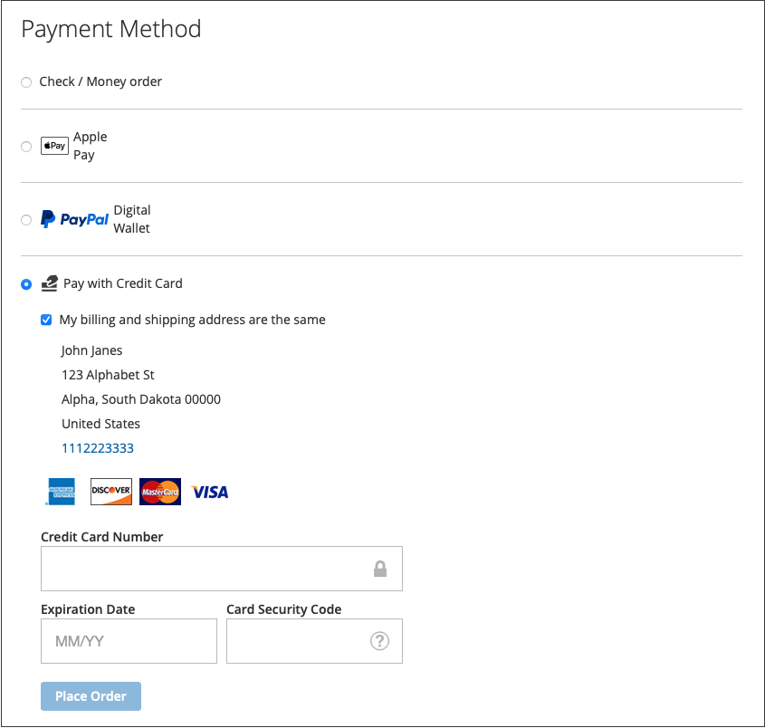

# 付款选项

替换为 [!DNL Adobe Commerce] 和 [!DNL Magento Open Source] [!DNL Payment Services]，您有多个可用的支付选项。

您可以在以下位置配置这些付款选项： [主页设置](payments-home.md) 或 [存储配置](configure-admin.md) （建议使用旧版支付选项或多商店设置）。

根据结账过程中的位置，每种支付方式都有不同的行为：

* 产品页 — 项目的产品页
* 迷你购物车 — 将产品添加到购物车后，单击购物车图标即可使用
* 购物车 — 单击时可用 _查看和编辑购物车_ 从迷你购物车
* 签出视图 — 单击时可用 _继续操作直到进入结账流程_ 从迷你购物车或购物车

>[!IMPORTANT]
>
>[!DNL Payment Services] 在处理付款之前，必须完成入门培训。

## 标准支付体验与高级支付体验

[!DNL Payment Services] 提供 **高级** （完全支持）和 **标准** （快速结帐）支付选项和载入流程，具体取决于您运营的国家/地区。

* **高级**  — 全部可用 [支付选项](../payment-services/payments-options.md) 当前可用 [得到充分支持的国家](../payment-services/overview.md#availability). 在新用户引导以启用实时支付时，选择 [高级入门选项](../payment-services/production.md#advanced-onboarding).
* **标准**  — 一部分支付选项（快速结账） — PayPal信用卡和借记卡 — 适用于其他受支持的国家/地区。 [信用卡字段](#credit-card-fields) 和 [Apple Pay](#apple-pay-button) 不适用于此入门培训选项。 在新用户引导以启用实时支付时，选择 [标准载入选项](../payment-services/production.md#standard-onboarding).

请参阅 [启用 [!DNL Payment Services] 用于生产](../payment-services/production.md#complete-merchant-onboarding) 有关完成高级和标准载入的信息。

## [!UICONTROL Credit Card Fields]

[!UICONTROL Credit Card Fields] 为信用卡或借记卡支付方法提供简单且安全的结账。 当购物者使用信用卡字段结账时，他们输入姓名、帐单地址以及信用卡或借记卡信息以下订单。 他们的客户信息在购买会话期间被安全地使用，以无缝地引导他们完成结账流程。

{width="500" zoomable="yes"}

启用 [信用卡保险存储](#vaulting) 以便您的商店允许购物者保存（保存）其信用卡信息以便稍后快速结帐。

您可以配置 [!UICONTROL Credit Card Fields] 在商店配置或 [!DNL Payment Services] 家。 请参阅 [设置](settings.md#credit-card-fields) 以了解更多信息。

您还可以更改信用卡字段的布局、宽度、高度和外部样式。 请参阅 [PayPal文档](https://developer.paypal.com/docs/checkout/advanced/customize/card-field-style/) 以了解更多信息。

## [!DNL Apple Pay] 按钮

客户可以使用 [[!DNL Apple Pay]](https://www.apple.com/apple-pay/)，使用存储在iOS或macOS设备上的信用卡和借记卡支付凭据进行购买。

[!DNL Apple Pay] 仅在Safari浏览器中可用。 商户在每个商户帐户中最多可以添加99个域。

{width="500" zoomable="yes"}

此 [!DNL Apple Pay] 按钮在产品页面、迷你购物车、购物车和结账视图中可见。

>[!NOTE]
>
> 使用 [!DNL Apple Pay] 对于您的商店，完成 [自助注册 [!DNL Apple Pay]](https://developer.paypal.com/docs/checkout/apm/apple-pay/#register-your-live-domain) (_注册您的实时域_ 部分)和 [在中为您的商店配置它 [!DNL Payment Services]](settings.md#payment-buttons).

您可以配置 [!UICONTROL Apple Pay] 在商店配置或Payment Services主页中。 请参阅 [设置](settings.md#apple-pay) 以了解更多信息。

## [!DNL Google Pay] 按钮

客户可以使用 [[!DNL Google Pay]](https://pay.google.com/about/) 通过将支付详细信息添加到他们的Google帐户，可以将支付详细信息安全地存储在该帐户中，以实现无缝结账。

[!DNL Google Pay] 仅在某些国家或地区以及在某些设备上可用。 请参阅 [[!DNL Google Pay] 文档](https://developer.paypal.com/docs/checkout/apm/google-pay/#link-googlepayintegration) 以了解更多信息。

{width="500" zoomable="yes"}

此 [!DNL Google Pay] 按钮在产品页面、迷你购物车、购物车和结账视图中可见。

您可以配置 [!UICONTROL Google Pay] 在商店配置或Payment Services主页中。 请参阅 [设置](configure-admin.md) 以了解更多信息。

>[!NOTE]
>
> 此 [!DNL Google Pay] API只能在安全的上下文中用于网站。 请参阅 [疑难解答](https://developers.google.com/pay/api/web/support/troubleshooting) 文档，以了解更多信息。

## [!DNL PayPal Payment Buttons]

[!DNL PayPal payment buttons]，使用PayPal完成购买，存储购物者的送货地址、帐单地址和付款详细信息，以供将来使用。 购物者可以使用PayPal以前存储或提供的任何支付方式。

{width="350" zoomable="yes"}

您可以配置 [!UICONTROL PayPal payment buttons] 在商店配置或 [!DNL Payment Services] 家。 请参阅 [设置](settings.md#payment-buttons) 以了解更多信息。

了解PayPal中按国家/地区划分的支付方法可用性 [支付方式文档](https://developer.paypal.com/docs/checkout/payment-methods/).

### [!DNL PayPal] 按钮

客户可以使用PayPal按钮轻松自信地结帐。

此 [!DNL PayPal] 按钮在产品页面、迷你购物车、购物车和结账视图中可见。

### [!DNL Venmo] 按钮

客户可使用以下工具结帐： [文莫](https://venmo.com/) 按钮。

此 [!DNL Venmo] 按钮在产品页面、迷你购物车、购物车和结账视图中可见。

### PayPal借记或信用卡按钮

客户可以使用“PayPal借记”或“信用卡”按钮结帐。

从结账页面可见PayPal借记卡或信用卡按钮。

此选项可用于通过PayPal托管的按钮向购物者提供借记或信用卡支付选项，作为信用卡集成的替代方法。

### [!DNL Pay Later] 按钮

向您的客户提供短期、免息的支付和其他融资选项，以便他们现在购买以后使用 [!DNL Pay Later] 按钮。

此 [!DNL Pay Later] 按钮在产品页面、迷你购物车、购物车和结账视图中可见。

请参阅中有关“稍后支付”优惠的信息 [PayPal的“稍后支付”优惠文档](https://developer.paypal.com/docs/checkout/pay-later/us/). 使用 **国家或地区** 下拉列表以选择感兴趣的区域。

了解如何禁用或启用 [!DNL Pay Later] 通过更新 [设置](settings.md#payment-buttons) 配置。

## 仅使用PayPal付款按钮

要快速将您的存储转入生产模式，您可以配置 _仅限_ PayPal付款按钮（Venmo、PayPal等） — 而不使用PayPal信用卡支付选项。

这允许您：

* 为您的客户提供各种支付选项，包括Venmo和PayPal支付按钮，以及关闭PayPal托管卡字段并使用现有信用卡提供商的选项。
* 使用您现有的信用卡提供商进行信用卡支付，同时使用PayPal的其他支付选项。
* 在PayPal不支持将信用卡作为付款选项的地区，使用PayPal的付款按钮。

至 **捕获付款 _仅限_ PayPal付款按钮(_非_ paypal信用卡支付选项)**：

1. 确保您的商店 [在生产模式下](settings.md#enable-payment-services).
1. [配置所需的PayPal付款按钮](settings.md#payment-buttons) 在设置中。
1. 翻转 _关闭_ 该 **[[!UICONTROL Show PayPal Credit and Debit card button]](settings.md#payment-buttons)** 中的选项 _[!UICONTROL Payment buttons]_部分。

至 **获取与您现有的信用卡提供商的付款 _和_ PayPal付款按钮**：

1. 确保您的商店 [在生产模式下](settings.md#enable-payment-services).
1. [配置所需的PayPal付款按钮](settings.md#payment-buttons).
1. 翻转 _关闭_ 该 **[[!UICONTROL PayPal Show Credit and Debit card button]](settings.md#payment-buttons)** 中的选项 _[!UICONTROL Payment buttons]_部分。
1. 翻转 _关闭_ 该 **[[!UICONTROL Show on checkout page]](settings.md#credit-card-fields)** 中的选项 _[!UICONTROL Credit card fields]_部分并使用您的 [现有信用卡提供商帐户](https://experienceleague.adobe.com/docs/commerce-admin/stores-sales/payments/payments.html#payments).

## 订单重新计算

当客户从迷你购物车、购物车或产品页面进入结账流程时，会被定向到订单审核页面，他们可以在PayPal弹出窗口中看到选定的送货地址。 在客户选择发运方法后，订单金额会适当重新计算，并且客户可以看到发运成本和税额。

当客户从结帐页面进入结帐流程时，系统已知道送货地址和最终计算金额，并且总计已正确显示。

免税期、运费和销售税可能因地点而异。 之后 [!DNL Payment Services] 接收送货地址和运费，然后快速重新计算所有适用的成本，并在结账的最后阶段适当地显示这些成本。

## 信用卡保险存储

购物者可以将其信用卡信息保存或“保存”，以便将来在网站级别（同一商家帐户内的任何商店）进行购买。

请参阅 [信用卡保险存储](vaulting.md) 以了解更多信息。

## 安全性

请参阅 [PCI合规性](security.md#pci-compliance) 以了解更多信息。
