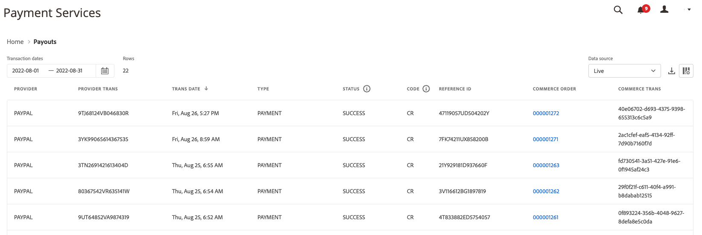

# 支付报表

[!DNL Payment Services] 对象 [!DNL Adobe Commerce] 和 [!DNL Magento Open Source] 提供全面的报告，以便您清楚地了解商店的订单和付款。

有两个可用的“付款”报告视图，使您能够查看有关所有付款的深入信息：

* **[支付数据可视化视图](#payouts-data-visualization-view)** — 支付服务主页上的图表，它直观地呈现支付报表视图中每天的合计金额
* **[支付报表视图](#payouts-report-view)** — 支付中可用的报告，显示所有事务处理的详细支付信息

付款视图一目了然地显示综合付款信息，使您可以完全透明地查看付款金额、处理数量以及财务调节事务处理层的详细报告。

>[!NOTE]
>
>付款报表仅显示捕获的订单(付款活动设置为 [`Authorize and Capture`](https://experienceleague.adobe.com/docs/commerce-merchant-services/payment-services/get-started/production.html#set-payment-services-as-payment-method)) — 或 [标记为 `Invoiced`](https://docs.magento.com/user-guide/sales/invoice-create.html).

## 支付数据可视化视图

支付数据可视化图表视图在Payment Services主页中提供。 它是详细表格中每天总量的可视化表示形式 [支付报表视图](#payouts-report-view).

在 _管理员_ 侧栏，转到 **[!UICONTROL Sales]** > **[!UICONTROL Payment Services]** 查看信用与借记的数据可视化图表以及一段时间内的移动平均值。

单击 **[!UICONTROL View Report]** 导航到详细的表格 [支付报表视图](#payouts-report-view).

### 自定义事务时间范围

默认情况下，将显示30天的交易。

从“支付数据”可视化图表视图中，您可以通过选择日期范围来自定义要查看的支付事务处理的时间范围：

1. 在 _管理员_ 侧栏，转到 **[!UICONTROL Sales]** > **[!UICONTROL Payment Services]**. 付款数据可视化图表视图在“付款”部分中可见。
1. 单击 **[!UICONTROL Range]** 选择器过滤器。
1. 选择适用的日期范围 — 30天、15天或7天。
1. 查看指定日期的事务信息。

### 交易信息

所选日期范围的交易记录金额显示在支付数据可视化视图的左侧。 所选日期范围的日期显示在视图底部。 如果特定日期没有付款，则该日期将不显示。

支付数据可视化图表视图包含以下信息。

| 数据 | 描述 |
| ------------ | -------------------- |
| [!UICONTROL Transaction amount] | 指定时间范围内交易记录的金额范围；Y轴上的数据（左） |
| 日期范围 | 指定时间范围的日期范围；X轴（底部）上的数据 |
| 来源 | 指定时间范围的付款 |
| 借方 | 指定时间范围内的借项（退款） |
| 均线 | 表示指定时间范围内每个日期的平均付费 |
| 范围净值 | 指定时间范围（范围）的净支付额 |

## 支付报表视图

付款服务的“付款”视图中提供“付款”报表视图。 它包括有关您商店的付款的所有可用信息。 此 [支付数据可视化视图](#payouts-data-visualization-view) 在Payment Services Home中，您可以在此更详细的报表视图中直观地表示每天的总金额。

在 _管理员_ 侧栏，转到 **[!UICONTROL Sales]** > **[!UICONTROL Payment Services]** > **[!UICONTROL Payouts]** 查看详细的表格式支付报表视图。

您可以根据本主题中的部分配置此视图，以便最好地呈现您希望查看的数据。

请参阅“管理员”的“付款”报表中链接的商务订单和交易ID、交易金额、每笔交易的付款方式等。

您可以下载.csv文件格式的支付交易，以便在现有的会计或订单管理软件中使用。

>[!NOTE]
>
>此表中显示的数据按降序排序(`DESC`)默认情况下，使用 `TRANS DATE`. 此 `TRANS DATE` 是启动交易的日期和时间。

### 选择数据源

在“付款”报表视图中，您可以选择数据源 — _[!UICONTROL Live]_或_[!UICONTROL Sandbox]_ — 您希望查看其报告结果。

如果 _[!UICONTROL Live]_是选定的数据源，则可以查看实时存储的报表信息。 如果 [!UICONTROL Sandbox]_是选定的数据源，您可以看到沙盒环境的报表信息。

数据源选择的工作方式如下：

* 如果您没有任何处于实时模式的存储，则数据源选择将默认为 _[!UICONTROL Sandbox]_.
* 如果您在实时模式下有任何存储（一个或多个），则数据源选择将默认为 _[!UICONTROL Live]_.
* 报表导出始终遵循数据源选择。

要为订单付款状态报表选择数据源，请执行以下操作：

1. 在 _管理员_ 侧栏，转到 **[!UICONTROL Sales]** > **[!UICONTROL Payment Services]** > **[!UICONTROL Payouts]**.
1. 单击 **[!UICONTROL Data source]** 并选择 _[!UICONTROL Live]_或_[!UICONTROL Sandbox]_.

   报表结果会根据所选数据源重新生成。

### 查看交易记录

默认情况下，将显示30天的交易。

搜索中返回的行数，或显示在默认的30天事务处理中的行数，显示在付款视图网格的上方，与事务处理日期日历选择器过滤器一起显示。

向左和向右滚动以查看 [每个付款交易记录的信息](#column-descriptions) 在每日报表中，包括事务处理日期、参考ID、发票编号和付款方式详细信息。

#### 自定义事务时间范围

从“支付报表”视图中，您可以通过输入特定日期或从日期选择器中选择日期范围，自定义要查看的支付事务处理的时间范围：

1. 在 _管理员_ 侧栏，转到 **[!UICONTROL Sales]** > **[!UICONTROL Payment Services]** > **[!UICONTROL Payouts]**.
1. 单击交易日期日历选择器过滤器。
1. 选择适用的日期范围。
1. 查看网格中指定日期的付款状态。

### 显示和隐藏列

默认情况下，“付款”报表视图会显示大多数可用的信息列。 但是，您可以自定义您在报表中看到的列。

1. 在 _管理员_ 侧栏，转到 **[!UICONTROL Sales]** > **[!UICONTROL [!DNL Payment Services]]** > **[!UICONTROL Payouts]**.
1. 单击 _列设置_ 图标()。
1. 要自定义您在报表中看到的列，请选中或取消选中列表中的列。

   支付报表视图将立即显示您在“列设置”菜单中所做的任何更改。 列首选项将进行保存，如果您离开报表视图，这些首选项将保持有效。

### 下载交易

您可以下载一个.csv文件，其中包含在“付款”视图网格中可见的所有交易。

1. 在 _管理员_ 侧栏，转到 **[!UICONTROL Sales]** > **[!UICONTROL Payment Services]** > **[!UICONTROL Payouts]**.
1. [自定义交易的日期范围时间范围](#customize-transactions-timeframe).
1. 单击 _下载_ ()图标。

您的付款交易记录将以.csv格式下载。

### 列描述

支付报表包括以下信息。

| 列 | 描述 |
| ------------ | -------------------- |
| [!UICONTROL Provider] | 付款提供商 |
| [!UICONTROL Provider trans] | 交易ID |
| [!UICONTROL Trans date] | 启动交易的日期和时间 |
| [!UICONTROL Type] | 交易类型 — *[!UICONTROL PAYMENT]*， *[!UICONTROL BONUS]*， *[!UICONTROL CHARGEBACK]*， *[!UICONTROL CORRECTION]*， *[!UICONTROL CURRENCY_CONVERSATION]*， *[!UICONTROL DEPOSIT]*， *[!UICONTROL DISBURSEMENT]*， *[!UICONTROL DISPUTE]*， *[!UICONTROL FEES]*， *[!UICONTROL HOLD]*， *[!UICONTROL HOLD_RELEASE]*， *[!UICONTROL INCENTIVES]*， *[!UICONTROL OTHERS]*， *[!UICONTROL RECOUP]*， *[!UICONTROL REFUND]*， *[!UICONTROL REVERSAL]*， *[!UICONTROL WITHDRAWAL]*    参见 [交易类型](#transaction-types) 了解更多信息。 |
| [!UICONTROL Status] | 交易的当前状态 — *[!UICONTROL SUCCESS]*， *[!UICONTROL DENIED]*， *[!UICONTROL PENDING]* |
| [!UICONTROL Code] | 表示贷方(*CR*)或借方(*DR*) |
| [!UICONTROL Reference ID] | 与此事件相关的原始交易ID |
| [!UICONTROL Invoice] | 交易的发票ID（每张订单一个） |
| [!UICONTROL Commerce order] | 商业订单ID    查看相关内容 [订单信息](https://docs.magento.com/user-guide/sales/orders.html){target="_blank"}中，单击ID。 |
| [!UICONTROL Commerce trans] | 商业交易ID    查看相关内容 [交易信息](https://docs.magento.com/user-guide/sales/transactions.html){target="_blank"}中，单击ID。 |
| [!UICONTROL Pay method] | 信用卡类型 — *[!UICONTROL BANK]*， *[!UICONTROL PAYPAL]*， *[!UICONTROL APPLE_PAY]*， *[!UICONTROL CREDIT_CARD]* — 和相关联的卡提供商(例如 *Visa* 或 *MasterCard*) |
| [!UICONTROL Trans amt] | 交易金额 |
| [!UICONTROL Cur] | 交易记录金额的货币单位 |
| [!UICONTROL Pending] | 尚未支付的金额 |
| [!UICONTROL Cur] | 待定金额的货币单位 |
| [!UICONTROL Seller amt] | 向客户转移或从客户转移的资金金额    从卖方账户移出的资金会显示一个短划线(-)前缀。 |
| [!UICONTROL Cur] | 卖方金额的货币单位 |
| [!UICONTROL Partner fee] | 与交易相关的合作伙伴费用    从合作伙伴费用帐户移出的基金会显示一个短划线(-)前缀。 |
| [!UICONTROL Cur] | 合作伙伴费用的货币单位 |
| [!UICONTROL Prov fees] | 与交易相关的费用    从提供商费用帐户中移出的基金显示一个短划线(-)前缀。 |
| [!UICONTROL Cur] | 提供商费用的货币单位 |
| [!UICONTROL Fee %] | 收取费用的交易金额的百分比 |
| [!UICONTROL Fixed fee] | 固定提供商费用金额 |
| [!UICONTROL Chbk fee] | 与交易相关的拖缺款项    短划线(-)前缀表示按存储容量使用计费已撤销。 |
| [!UICONTROL Cur] | 拖缺费用的货币单位 |
| [!UICONTROL Hold amt] | 暂挂或解除暂挂的金额    短划线(-)前缀表示正在释放暂挂资金。 |
| [!UICONTROL Cur] | 暂挂金额的货币单位 |
| [!UICONTROL Recoup amt] | 从补偿帐户中扣除的金额    从回收帐户移出的资金显示一个短划线(-)前缀。 |
| [!UICONTROL Cur] | 扣除金额的货币单位 |

### 交易类型

支付交易可记录这些交易类型。

| 报告 | 描述 |
| ------------ | -------------------- |
| [!UICONTROL PAYMENT] | 为订单在买方和卖方之间转移的资金 |
| [!UICONTROL AUTH] | 授权和授权撤消事务处理 |
| [!UICONTROL BONUS] | -- |
| [!UICONTROL CHARGEBACK] | 拖缺款项费用与拖缺款项费用冲销交易记录 |
| [!UICONTROL CORRECTION] | -- |
| [!UICONTROL CURRENCY_CONVERSION] | -- |
| [!UICONTROL DEPOSIT] | -- |
| [!UICONTROL DISBURSEMENT] | -- |
| [!UICONTROL DISPUTE] | -- |
| [!UICONTROL FEES] | 合作伙伴费用、支付费用和费用冲销交易 |
| [!UICONTROL HOLD] | -- |
| [!UICONTROL HOLD_RELEASE] | -- |
| [!UICONTROL INCENTIVES] | -- |
| [!UICONTROL OTHERS] | -- |
| [!UICONTROL RECOUP] | 从银行或亏损帐户中收回 |
| [!UICONTROL REFUND] | -- |
| [!UICONTROL REVERSAL] | -- |
| [!UICONTROL WITHDRAWAL] | -- |
