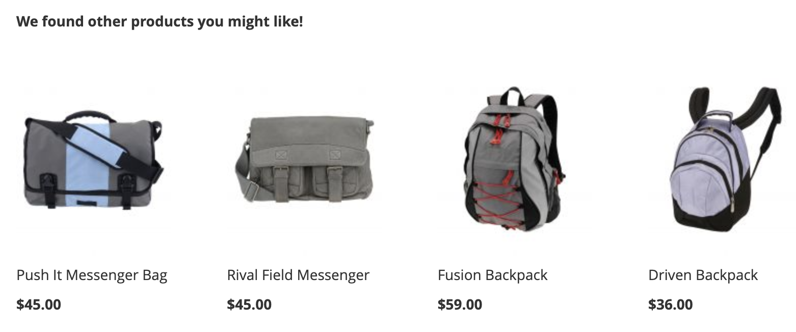

# 创建新推荐

创建推荐时，您会创建 _推荐单元_ 包含推荐产品的 _项目_.

_推荐单元_

激活推荐单元后，Adobe Commerce将开始 [收集数据](workspace.md) 来测量展示次数、查看次数、点击次数等。 的 [!DNL Product Recommendations] 表格显示每个推荐单元的量度，以帮助您做出明智的业务决策。

1. 在 _管理员_ 侧栏，转到 **营销** > _促销活动_ > **产品Recommendations** 以显示 _产品Recommendations_ 工作区。

1. 指定 [存储视图](https://docs.magento.com/user-guide/configuration/scope.html) 显示推荐的位置。

   >[!NOTE]
   >
   > 只能为默认存储视图创建页面生成器推荐单元。 要了解有关使用页面生成器创建产品推荐的更多信息，请参阅 [添加内容 — 产品Recommendations](https://docs.magento.com/user-guide/cms/page-builder-add-recommendations.html).

1. 单击 **创建推荐**.

1. 在 _命名推荐_ 部分，输入内部引用的描述性名称，如 `Home page most popular`.

1. 在 _选择页面类型_ 部分，从以下选项中选择希望显示推荐的页面：

   - 主页
   - 类别
   - 产品详细信息
   - 购物车
   - 确认
   - [页面生成器](https://docs.magento.com/user-guide/cms/page-builder-add-recommendations.html)

   对于每个页面类型，您最多可以创建五个活动推荐单元，对于页面生成器，最多可以创建25个活动推荐单元。 页面类型灰显。达到限制时。

   
   _推荐名称和页面版面_

1. 在 _选择推荐类型_ 部分，指定 [推荐类型](type.md) 您希望显示在选定页面上。 对于某些页面， [投放](placement.md) “推荐”仅限于某些类型。

   某些推荐类型使用购物者的行为数据来 [列车机器学习模型](behavioral-data.md) 以构建个性化推荐。 为了帮助您可视化每个推荐类型的培训进度，此部分显示每种类型的准备情况。 这些准备情况指标基于以下几个因素进行计算：

   - 足够的结果集大小：在大多数情况下，是否返回了足够的结果以避免使用 [备份建议](behavioral-data.md#backuprecs)?

   - 足够的结果集变量：要返回的产品是否代表您目录中的各种产品？ 考虑此因素的目标是避免让少数产品成为网站中推荐的唯一项目。

   根据上述因素，计算并显示准备值。 当推荐类型的就绪值为75%或更高时，该推荐类型会被视为已准备好部署。 推荐类型在准备就绪率至少为50%时，会认为已部分准备就绪。 最后，当推荐类型的就绪值小于50%时，该推荐类型会被视为未准备好部署。

   
   _推荐类型_

1. 在 _店面显示标签_ ，输入 [标签](placement.md#recommendation-labels) 对您的购物者可见的，例如“最畅销商品”。

1. 在 _选择产品数量_ 部分，使用滑块指定要在推荐单元中显示的产品数量。

   默认值为 `5`，最大为 `20`.

1. 在 _选择版面_ 部分，指定推荐单元在页面上显示的位置。

   - 在主内容的底部
   - 主内容顶部

1. （可选）要更改推荐的顺序，请选择并移动 _选择位置_ 表。

   的 _选择位置_ 部分显示为您选择的页面类型创建的所有推荐（如果有）。

   
   _页面上的推荐顺序_

1. （可选）在 _过滤器_ 部分， [应用过滤器](filters.md) 以控制哪些产品显示在推荐单元中。

   
   _推荐产品过滤器_

1. 完成后，单击以下任一项：

   - **另存为草稿** 以后编辑推荐单元。 在草稿状态下，您无法修改推荐单元的页面类型或推荐类型。

   - **激活** 以在店面上启用推荐单元。

## 预览Recommendations {#preview}

的 _推荐的产品预览_ 面板始终可用，其中包含一系列产品（在将其部署到店面时，这些产品可能会显示在推荐单元中）的样例选择。

要在非生产环境中工作时测试推荐，您可以从 [不同来源](settings.md). 这允许商户在部署到生产之前尝试使用规则并预览推荐。

| 字段 | 描述 |
|---|---|
| 名称 | 产品的名称。 |
| SKU | 分配给产品的库存单位 |
| 价格 | 产品的价格。 |
| 结果类型 | 主要 — 表示收集的培训数据足以显示推荐。 备份 — 表示收集的培训数据不足，因此使用备用推荐来填充插槽。 转到 [行为数据](behavioral-data.md) 了解有关机器学习模型和备用建议的更多信息。 |

在创建推荐单元时，尝试使用页面类型、推荐类型和过滤器，以立即获得有关将包含的产品的实时反馈。 在您开始了解显示哪些产品时，您可以配置推荐单元以满足您的业务需求。

Adobe Commerce [过滤器](filters.md) 推荐，以避免在单个页面上部署多个推荐单元时显示重复的产品。 因此，预览面板中显示的产品可能与店面中显示的产品有所不同。

>[!NOTE]
>
> 无法预览 `Recently viewed` 推荐类型，因为数据在管理员中不可用。
