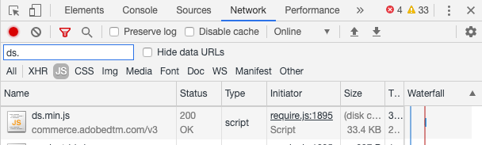

# 验证事件集合

在您之后 [安装和配置](install-configure.md) 该 `magento/product-recommendations` 模块中，您可以验证行为数据是否已发送到Adobe Commerce。 您可以使用Chrome中提供的开发人员工具，或者安装Snowplow Chrome扩展。 如果您需要其他帮助，请参阅 [疑难解答 [!DNL Product Recommendations] 模块](https://experienceleague.adobe.com/docs/commerce-knowledge-base/kb/troubleshooting/miscellaneous/troubleshoot-product-recommendations-module-in-magento-commerce.html) 在支持知识库中。

## 使用Chrome中的开发人员工具进行验证

要确保在所有网站页面上加载事件收集器JS文件，请执行以下操作：

1. 在Chrome，选择 **自定义和控制Google Chrome** 然后选择 **更多工具** > **开发人员工具**.
1. 选择 **网络** 选项卡，然后选择 **JS** 类型。
1. 筛选对象 `ds.`
1. 重新加载页面。
1. 您应该看到 `ds.js` 或 `ds.min.js` 在 **名称** 列。

_事件收集器JS_

要确保整个网站（主页、产品、结帐等）的页面上触发事件，请执行以下操作：

1. 请确保在浏览器上禁用所有广告拦截器，并在网站上接受Cookie。
1. 在Chrome，选择 **自定义和控制Google Chrome** （浏览器右上角的三个垂直圆点），然后选择 **更多工具** > **开发人员工具**.
1. 选择 **网络** 选项卡并筛选 `tp2`.
1. 重新加载页面。
1. 您应会在下看到呼叫 `tp2` 在 **名称** 列。

_验证事件是否正在触发_

## 使用Snowplow Chrome扩展进行验证

安装 [适用于Chrome的Snowplow Analytics调试器扩展](https://chrome.google.com/webstore/detail/snowplow-analytics-debugg/jbnlcgeengmijcghameodeaenefieedm). 此扩展显示正在收集并发送到Adobe Commerce的事件。

1. 请确保在浏览器上禁用所有广告拦截器，并在网站上接受Cookie。

1. 在Chrome，选择 **自定义和控制Google Chrome** （浏览器右上角的三个垂直圆点），然后选择 **更多工具** > **开发人员工具**.

1. 选择 **Snowplow分析调试器** 选项卡。

1. 在 **事件** 列，选择 **结构化事件**.

1. 向下滚动直到看到 **上下文数据 _n_**. 在中查找店面实例&#x200B;**架构**.

1. 验证 [SaaS数据空间ID](https://experienceleague.adobe.com/docs/commerce-admin/config/services/saas.html) 已正确设置。

_雪铲滤镜_

>[!NOTE]
>
> 值 `Data validity : NOT FOUND` 在debugger中，指示内部架构。 Snowplow Chrome插件无法验证具有内部架构的事件。 这不会对实际功能产生影响。

## 验证事件是否正确触发

要验证用于量度的事件是否正确触发，请查找 `impression-render`， `view`、和 `rec-click` Snowplow Analytics Debugger中的事件。 请参阅 [事件的完整列表](https://experienceleague.adobe.com/docs/commerce-merchant-services/product-recommendations/developer/events.html).

>[!NOTE]
>
> 如果 [Cookie限制模式](https://experienceleague.adobe.com/docs/commerce-admin/start/compliance/privacy/compliance-cookie-law.html) 如果启用，Adobe Commerce将不会收集行为数据，直到购物者同意为止。 如果“Cookie限制模式”被禁用，则默认情况下会收集行为数据。
