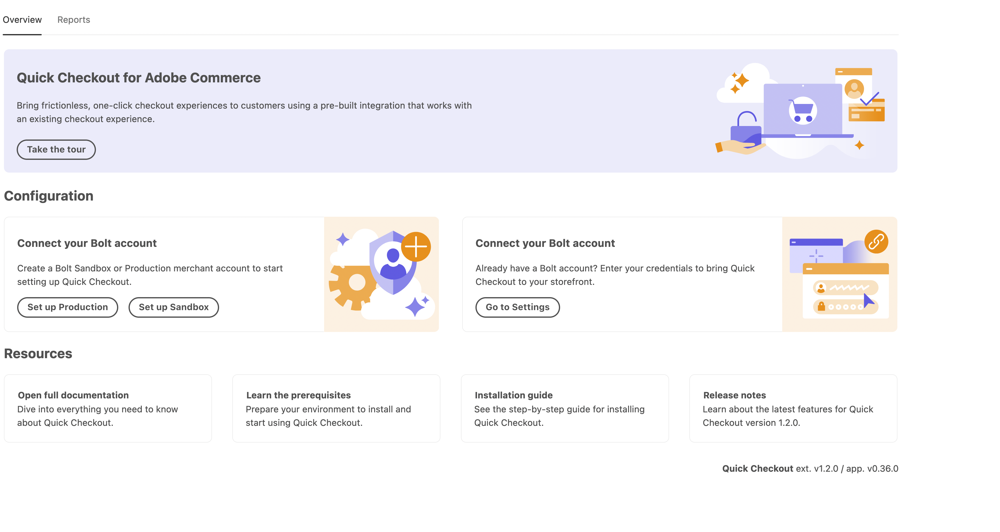

# [!DNL Quick Checkout] 载入

开始使用 [!DNL Quick Checkout] 对于Adobe Commerce扩展，您必须完成一些入门步骤，才能将您的实例与我们的签出功能连接起来。

1. [获取扩展](#get-extension).
1. [使用创建生产或沙盒商户帐户 [!DNL Bolt]](#create-account-with-bolt). 提供验证您的身份所需的所有信息。
1. [提供 [!DNL API Key] 和 [!DNL Publishable Key]](#obtain-api-credentials) 生成于 [!DNL Bolt].
1. [在 [!DNL Bolt] 帐户](#configure-payment-providers).
1. [将“启用”下拉列表设置为“是”](#enable-extension) 激活扩展。
1. [定义服务设置](#complete-admin-configuration) 配置 [!DNL Quick Checkout] 扩展。
1. [单击保存配置](#enable-live-quick-checkout) 按钮以启用扩展。
1. 将范围切换为 **主网站** 和 [单击配置回调URL](#check-shopper-valid-account) 按钮。

如果启用了Gainsight，则会触发 **参观** 按钮 [!DNL Quick Checkout] 管理面板关于 [!DNL Quick Checkout] 对于Adobe Commerce:

1. 在 _管理员_ 侧栏，转到 **[!UICONTROL Stores]** > **[!UICONTROL Configuration]** >高级：

   

如果未启用Gainsight，请继续入门步骤。

请参阅 [[!DNL Quick Checkout] “管理员”面板](../quick-checkout/admin-panel.md) 主题以了解更多信息。

>[!NOTE]
>
> 如果您未配置 [!DNL Bolt] 帐户无法设置沙盒或生产环境。

## 先决条件

为了使用 [!DNL Quick Checkout]，则您必须在 [!DNL Bolt]:

- 支持的支付提供商
- 中的商家和生产帐户 [!DNL Bolt]
- API和 [!DNL Publishable key] 生成于 [!DNL Bolt]

请参阅 [先决条件](../quick-checkout/prerequisites.md) 主题以了解更多信息。

请参阅 [API凭据](#obtain-api-credentials) 了解如何创建或访问 [!DNL API keys] 例如。

## 获取扩展

请参阅 [安装](../quick-checkout/install.md) 有关获取扩展的详细信息的主题。

## 创建帐户 [!DNL Bolt]

在配置 [!DNL Quick Checkout] 在Adobe Commerce管理员中，需要创建 [沙盒](https://merchant-sandbox.bolt.com/register?platform=magento2){target=&quot;_blank&quot;}和 [生产](https://merchant.bolt.com/register?platform=magento2){target=&quot;_blank&quot;}中的商户帐户 [!DNL Bolt]. 提供在中创建帐户所需的所有详细信息 [!DNL Bolt].

请参阅 [测试和验证](../quick-checkout/testing.md) 主题以了解更多信息。

## 获取API凭据

使用 [!DNL Quick Checkout] 您需要 [!DNL Bolt] 唯一键和 [!DNL signing secret]. 获取以下内容 [!DNL API keys] 导航至 **开发人员** > **API** > **键** 在 **螺栓商户仪表板**.

- [!DNL API key]:后端用于与交互的私钥 [!DNL Bolt] API。
- [!DNL Publishable key]:前端用于与交互的键 [!DNL Bolt] API。
- [!DNL Signing secret]:用于对从接收的请求进行签名验证 [!DNL Bolt].

   

请参阅 [[!DNL Bolt] 环境详细信息](https://help.bolt.com/developers/references/environment-details/#about-keys){target=&quot;_blank&quot;}页，用于了解密钥和签名密钥 [!DNL Bolt] 对于 [!DNL Quick Checkout] 扩展。

>[!CAUTION]
>
> 您必须创建 [!DNL API keys] 适用于沙盒和生产环境。

## 配置支付提供商

要连接您的支付服务提供商，请按照 [处理器设置](https://help.bolt.com/integrations/adobe-quick-checkout/set-up/){target=&quot;_blank&quot;}开发人员 [!DNL Bolt] 页面。

## 启用扩展

1. 在 _管理员_ 侧栏，转到 **商店** > _设置_ > **配置**.
1. 在左侧面板中，展开 **销售** 选择 **结帐**.
1. 在 [!DNL Quick Checkout] 视图，设置 **启用** to `Yes`.

>[!CAUTION]
>
> 快速结帐字段仅在 **启用** 设置为 `Yes`.

1. 选择要使用的方法（沙盒或生产）。

   - 用于测试和开发的沙盒
   - 生产以处理与实时支付处理器的交易

1. 提供您的唯一API后验证凭据，并 [!DNL Publishable keys].

请参阅 [设置](../quick-checkout/settings-quick-checkout.md) 主题，以详细了解 [!DNL Quick Checkout] (对于Adobe Commerce扩展)。

>[!CAUTION]
>
> 您必须提供唯一的API和 [!DNL Publishable] 键，否则客户将看到付款表单，并且无法下订单。

## 完整的管理员配置

1. 在 _管理员_ 侧栏，导航到 **商店** > **配置** > **结帐** 访问常规的“结帐管理员配置”页面。
1. 在 _服务设置_ 部分，提供启用扩展所需的所有详细信息。
1. 已设置 _付款活动_ 选项之一：

   - `Authorize`:请勿在授权时自动捕获事务。
   - `Authorize and Capture`:根据授权自动捕获事务。

有关Adobe Commerce标准结账选项的更多信息，请参阅 [结账](https://docs.magento.com/user-guide/configuration/sales/checkout.html) 主题。

## 启用实时快速结帐

启用 [!DNL Quick Checkout] 对于Adobe Commerce扩展：

1. 检查 [!UICONTROL Enable] 下拉列表设置为 **是** 激活扩展。
1. 单击 **保存配置**.

## 检查购物者有效帐户

检查购物者是否具有 [!DNL Bolt] 帐户：

1. 将范围切换为 **主网站**.
1. 单击 **配置回调URL** 按钮。 这将启用 [!DNL Bolt] 以确定购物者是否具有帐户。 如果出现，则会显示“OTP”弹出窗口。

>[!CAUTION]
>
> 将范围切换到 **主网站** 确保设置正确的URL。 每个网站可以有多个域。

请参阅 [网站、商店和查看范围](https://experienceleague.adobe.com/docs/commerce-admin/start/setup/websites-stores-views.html#scope-settings){target=&quot;_blank&quot;}主题，以了解有关Adobe Commerce中作用域的更多信息。

## 获取帮助

入门流程旨在指导您完成设置和启用 [!DNL Express Checkout] 功能。

通过与Adobe Commerce支持部门联系 [Adobe Commerce帮助中心](https://experienceleague.adobe.com/docs/commerce-knowledge-base/kb/help-center-guide/magento-help-center-user-guide.html?lang=en) 来寻求帮助。

请参阅 [测试和验证](../quick-checkout/testing.md) 主题以了解更多信息。
