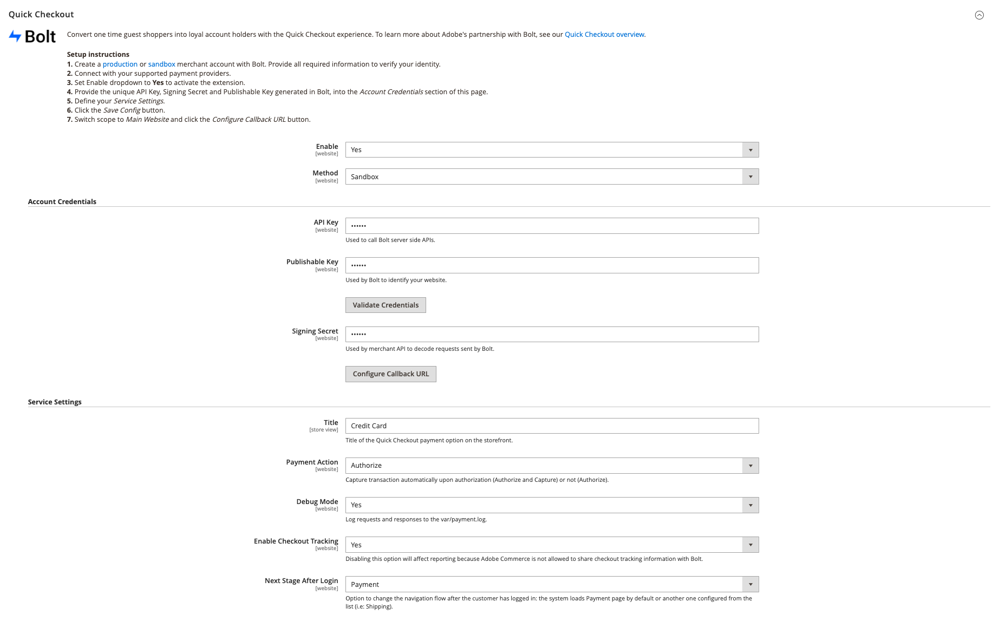

# [!DNL Quick Checkout] 设置

[!DNL Quick Checkout] 对于Adobe Commerce和Magento Open Source，将提供一个配置视图，其中包含设置扩展所需的所有信息。

要访问这些配置设置，请执行以下操作：

1. 在 _管理员_ 侧栏，转到 **商店** > _设置_ > **配置**.
1. 在左侧面板中，展开 **销售** 选择 **结帐**.

   

请参阅 [入门](../quick-checkout/onboarding.md) 有关如何配置的详细信息主题 [!DNL Quick Checkout] Adobe Commerce。

## 启用扩展

| 字段 | 范围 | 描述 |
|---|---|---|
| [!UICONTROL Enable] | 网站 | 启用或禁用 [!DNL Quick Checkout] 的URL。 选项： [!UICONTROL Yes] / [!UICONTROL No] |
| [!UICONTROL Method] | 网站 | 为 [!DNL Quick Checkout]. 选项： [!UICONTROL Sandbox] / [!UICONTROL Production] |

{style=&quot;table-layout:auto&quot;}

## 帐户凭据

| 字段 | 范围 | 描述 |
|---|---|---|
| [!UICONTROL API key] | 网站 | 后端用于与交互的私钥 [!DNL Bolt] API。 |
| [!UICONTROL Publishable key] | 网站 | 前端用于与交互的键 [!DNL Bolt] API。 |
| [!UICONTROL Signing secret] | 网站 | 用于对从接收的请求进行签名验证 [!DNL Bolt]. |

{style=&quot;table-layout:auto&quot;}

## 服务设置

| 字段 | 范围 | 描述 |
|---|---|---|
| [!UICONTROL Title] | 商店视图 | 在结帐期间，在“付款方法”视图中添加要显示为此付款选项标题的文本。 选项： [!UICONTROL text field] |
| [!UICONTROL Payment Action] | 网站 | 的 [付款操作](https://docs.magento.com/user-guide/configuration/sales/payment-methods.html#payment-actions){target=&quot;_blank&quot;}。 选项： [!UICONTROL Authorize] / [!UICONTROL Authorize and Capture] |
| [!UICONTROL Debug Mode] | 网站 | 启用或禁用调试模式。 选项： [!UICONTROL Yes] / [!UICONTROL No] |
| [!UICONTROL Enable checkout tracking] | 网站 | 定义Adobe Commerce是否允许与Bolt共享结帐跟踪信息。 默认启用。 如果禁用，则报表将受到影响。 选项： [!UICONTROL Yes] / [!UICONTROL No] |
| [!UICONTROL Next Stage After Login Mode] | 网站 | 客户登录后更改导航流程。 选项： [!UICONTROL Payment] / [!UICONTROL Shipping] |

{style=&quot;table-layout:auto&quot;}
